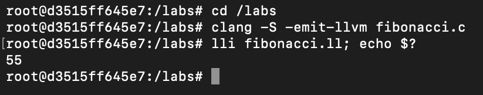

# Lab0 实验报告
孙昊哲 PB20000277

## 实验要求

1. 使用 Docker 镜像搭建实验环境
2. 配置 GitLab, Git

## 实验任务

1. 实验搭建成功截图

2. 对docker的理解

    docker虽然使用起来和虚拟机十分类似，但是本质上和虚拟机不同，虚拟机是将硬件虚拟化，而docker是将操作系统层虚拟化，因此具有更高的便携性。

    同时docker也可以针对不同操作系统，不同环境，配置出一套统一的环境，避免了因为版本，系统不一致带来的开发上的问题