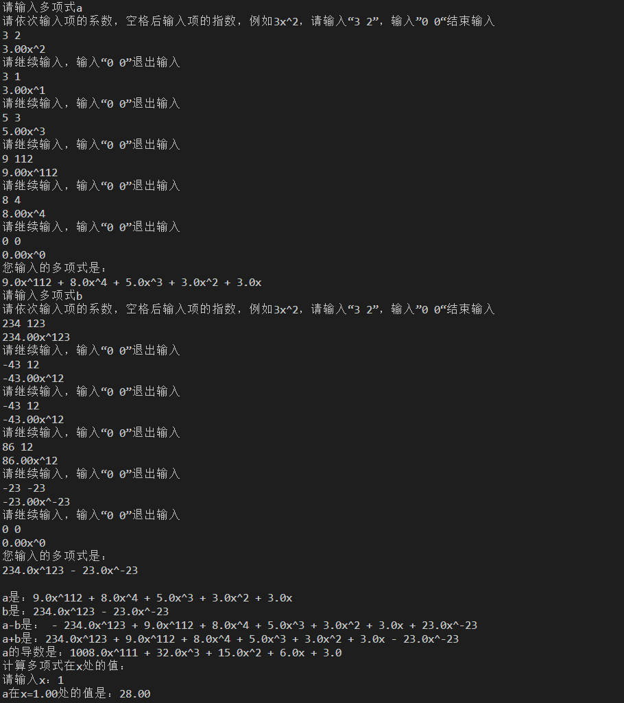

# Lab1实验报告
## 实验题目
多项式计算器，本次实验选做三个部分：计算多项式在x处的值；求多项式导数；用类数学表达式表示输出的多项式。

## 实验平台
Ubuntu 20.04

gcc 9.4.0

## 代码分析

1. 我们定义了两个结构体``Node``和``Poly``，``Node``用来表示多项式的每一项，``Poly``用来表示多项式的项数以及``Node``的头指针。

    ```C
    typedef struct Node{
        int exp; //多项式的指数
        double co; //多项式系数
        struct Node *NextNode; //指向下一个节点
    }Node;

    typedef struct Poly{
        int n; //多项式的项数，0表示没有建立多项式
        Node *header; //指向头指针
    }Poly;
    ```

2. CreatePoly
    
    ```C
    Poly *CreatePoly(){//该函数用于建立多项，并将多项式按照降幂的方式排列，并且会自动合并同类项
        Poly *poly;
        if((poly = (Poly *)malloc(sizeof(Poly)))) ; 
        else {
            printf("内存分配失败！\n");
            return NULL;//尝试分配地址，如果地址分配失败则返回NULL
        }
        poly->header = NULL;
        poly->n = 0;//建立多项式的指针，并初始化

        double co;
        int exp;
        printf("请依次输入项的系数，空格后输入项的指数，例如3x^2，请输入“3 2”，输入”0 0“结束输入\n");
        scanf("%lf %d",&co,&exp);
        printf("%0.2lfx^%d\n",co,exp);

        //建立多项式
        Node *node;
        if((node = (Node *)malloc(sizeof(Node)))) ; 
        else {
            printf("内存分配失败！\n");
            return NULL;//尝试分配地址，如果地址分配失败则返回NULL
        }

            while(co || exp){
            Node *p;
            p = poly->header;
            if(!p) {
                node->co = co;
                node->exp = exp;
                node->NextNode = NULL;
                poly->header = node;
                poly->n++; //如果多项式为空，则直接插入
            }
            else if(p->exp < exp){
                node->co = co;
                node->exp = exp;
                node->NextNode = p;
                poly->header = node;
                poly->n++; //判断是否需要在首项插入
            }
            else{
                while(p){
                    if(p->exp == exp){
                        p->co += co; //如果指数相同，则系数相加
                        break;
                    }
                    else if(p->exp > exp && (!p->NextNode || p->NextNode->exp < exp)){
                        node->co = co;
                        node->exp = exp;
                        node->NextNode = p->NextNode;
                        p->NextNode = node;
                        poly->n++; //判断是否需要在中间插入
                        break;
                    }
                    p = p->NextNode;
                }
            }

            printf("请继续输入，输入“0 0”退出输入\n");
            scanf("%lf %d",&co,&exp);
            printf("%0.2lfx^%d\n",co,exp);
            if((node = (Node *)malloc(sizeof(Node)))) ;
            else {
                printf("内存分配失败！\n");
                return NULL;//尝试分配地址，如果地址分配失败则返回NULL
            }
        }
        return poly;
    }
    ```
    
    该函数用于建立多项式，首先会建立一个多项式的指针，然后会循环输入多项式的每一项，然后会判断是否需要在首项插入，中间插入，还是尾项插入，最后会返回多项式的指针，并且会自动合并同类项，将结果按照降幂的方式排列。

3. PrintPoly

    ```C
    void PrintPoly(Poly *poly){//打印多项式,并且会自动去除系数为0的项(因为系数是浮点数，则会自动略去系数足够小的项)
        int i = 0; //用于判断是否是第一项，如果是第一项则不需要输出“+”
        Node *node;
        node = poly->header;
        while(node){
            if(node->exp == 0){
                if(node->co <= 0.00001 && node->co >= -0.00001){
                    node = node->NextNode;
                }
                else if(node->co < 0){
                    printf(" - ");
                    printf("%0.1lf",-node->co);
                    node = node->NextNode;
                    i = 1;
                }
                else if(node->co > 0){
                    if(i) printf(" + ");
                    printf("%0.1lf",node->co);
                    node = node->NextNode;
                    i = 1;
                }
            }
            else if(node->exp == 1){
                if(node->co <= 0.00001 && node->co >= -0.00001){
                    node = node->NextNode;
                }
                else if(node->co <= (1+0.00001) && node->co >= (1-0.00001)){
                    if(i) printf(" + ");
                    printf("x");
                    node = node->NextNode;
                    i = 1;
                }
                else if(node->co <= (-1+0.00001) && node->co >= (-1-0.00001)){
                    if(i) printf(" - ");
                    printf("x");
                    node = node->NextNode;
                    i = 1;
                }
                else if(node->co < 0){
                    printf(" - ");
                    printf("%0.1lfx",-node->co);
                    node = node->NextNode;
                    i = 1;
                }
                else{
                    if(i) printf(" + ");
                    printf("%0.1lfx",node->co);
                    node = node->NextNode;
                    i = 1;
                }
            }
            else if(node->co <= 0.00001 && node->co >= -0.00001){
                node = node->NextNode;
            }
            else if(node->co <= (1+0.00001) && node->co >= (1-0.00001)){
                if(i) printf(" + ");
                printf("x^%d",node->exp);
                node = node->NextNode;
                i = 1;
            }
            else if(node->co <= (-1+0.00001) && node->co >= (-1-0.00001)){
                printf(" - ");
                printf("x^%d",node->exp);
                node = node->NextNode;
                i = 1;
            }
            else if(node->co < 0){
                printf(" - ");
                printf("%0.1lfx^%d",-node->co,node->exp);
                node = node->NextNode;
                i = 1;
            }
            else{
                if(i) printf(" + ");
                printf("%0.1lfx^%d",node->co,node->exp);
                node = node->NextNode;
                i = 1;
            }
        }
        printf("\n");
    }
    ```

    该函数用于打印具有类数学表达式格式的多项式，首先会判断是否是常数项，然后会判断是否是一次项，然后会判断是否是其他项，最后会输出多项式。并且能够正确处理+-号；鉴于浮点数的精度有限，精度小于0.00001的项会被自动忽略。

4. AddPoly&&subPoly

    ```C
    Poly* AddPoly(Poly *poly1,Poly *poly2){//多项式相加
        Node *node1,*node2;
        Poly *poly;
        if((poly = (Poly *)malloc(sizeof(Poly)))) ;
        else {
            printf("内存分配失败！\n");
            return NULL;//尝试分配地址，如果地址分配失败则返回NULL
        }
        poly->n = 0;
        poly->header = NULL;

        Node *node, *tail; //建立一个新的多项式
        if((node = (Node *)malloc(sizeof(Node)))) ;
        else {
            printf("内存分配失败！\n");
            return NULL;//尝试分配地址，如果地址分配失败则返回NULL
        }

        node1 = poly1->header;
        node2 = poly2->header;
        while(node1 && node2){
            if(node1->exp == node2->exp){
                if(node1->co + node2->co <= 0.00001 && node1->co + node2->co >= -0.00001){
                    node1 = node1->NextNode;
                    node2 = node2->NextNode;
                }
                else{
                    node->co = node1->co + node2->co;
                    node->exp = node1->exp;
                    node->NextNode = NULL;
                    if(poly->n == 0){
                        poly->header = node;
                        tail = node;
                    }
                    else{
                        tail->NextNode = node;
                        tail = node;
                    }
                    poly->n++;
                    node1 = node1->NextNode;
                    node2 = node2->NextNode;
                }
            }
            else if(node1->exp > node2->exp){
                node->co = node1->co;
                node->exp = node1->exp;
                node->NextNode = NULL;
                if(poly->n == 0){
                    poly->header = node;
                    tail = node;
                }
                else{
                    tail->NextNode = node;
                    tail = node;
                }
                poly->n++;
                node1 = node1->NextNode;
            }
            else{
                node->co = node2->co;
                node->exp = node2->exp;
                node->NextNode = NULL;
                if(poly->n == 0){
                    poly->header = node;
                    tail = node;
                }
                else{
                    tail->NextNode = node;
                    tail = node;
                }
                poly->n++;
                node2 = node2->NextNode;
            }
            if((node = (Node *)malloc(sizeof(Node)))) ;
            else {
                printf("内存分配失败！\n");
                return NULL;//尝试分配地址，如果地址分配失败则返回NULL
            }
        }
        while(node1){
            node->co = node1->co;
            node->exp = node1->exp;
            node->NextNode = NULL;
            if(poly->n == 0){
                poly->header = node;
                tail = node;
            }
            else{
                tail->NextNode = node;
                tail = node;
            }
            poly->n++;
            node1 = node1->NextNode;
            if((node = (Node *)malloc(sizeof(Node)))) ;
            else {
                printf("内存分配失败！\n");
                return NULL;//尝试分配地址，如果地址分配失败则返回NULL
            }
        }
        while(node2){
            node->co = node2->co;
            node->exp = node2->exp;
            node->NextNode = NULL;
            if(poly->n == 0){
                poly->header = node;
                tail = node;
            }
            else{
                tail->NextNode = node;
                tail = node;
            }
            poly->n++;
            node2 = node2->NextNode;
            if((node = (Node *)malloc(sizeof(Node)))) ;
            else {
                printf("内存分配失败！\n");
                return NULL;//尝试分配地址，如果地址分配失败则返回NULL
            }
        }
        return poly;
    }

    Poly* SubPoly(Poly *poly1,Poly *poly2){//多项式相减
        Node *node1,*node2;
        Poly *poly;
        if((poly = (Poly *)malloc(sizeof(Poly)))) ;
        else {
            printf("内存分配失败！\n");
            return NULL;//尝试分配地址，如果地址分配失败则返回NULL
        }
        poly->n = 0;
        poly->header = NULL;

        Node *node, *tail; //建立一个新的多项式
        if((node = (Node *)malloc(sizeof(Node)))) ;
        else {
            printf("内存分配失败！\n");
            return NULL;//尝试分配地址，如果地址分配失败则返回空值
        }

        node1 = poly1->header;  
        node2 = poly2->header;
        while(node1 && node2){
            if(node1->exp == node2->exp){
                if(node1->co - node2->co <= 0.00001 && node1->co - node2->co >= -0.00001){
                    node1 = node1->NextNode;
                    node2 = node2->NextNode;
                    continue; //如果细数相减后系数为0，则不插入
                }
                else if(!poly->header){
                    node->co = node1->co - node2->co;
                    node->exp = node1->exp;
                    node->NextNode = NULL;
                    poly->header = node;
                    poly->n++;
                    tail = node;
                    node1 = node1->NextNode;
                    node2 = node2->NextNode;
                }
                else{
                    node->co = node1->co - node2->co;
                    node->exp = node1->exp;
                    node->NextNode = NULL;
                    poly->n++;
                    tail->NextNode = node;
                    tail = node;
                    node1 = node1->NextNode;
                    node2 = node2->NextNode;
                }
            }
            else if(node1->exp > node2->exp){
                if(!poly->header){
                    node->co = node1->co;
                    node->exp = node1->exp;
                    node->NextNode = NULL;
                    poly->header = node;
                    poly->n++;
                    tail = node;
                    node1 = node1->NextNode;
                }
                else{
                    node->co = node1->co;
                    node->exp = node1->exp;
                    node->NextNode = NULL;
                    poly->n++;
                    tail->NextNode = node;
                    tail = node;
                    node1 = node1->NextNode;
                }
            }
            else{
                if(!poly->header){
                    node->co = -node2->co;
                    node->exp = node2->exp;
                    node->NextNode = NULL;
                    poly->header = node;
                    poly->n++;
                    tail = node;
                    node2 = node2->NextNode;
                }
                else{
                    node->co = -node2->co;
                    node->exp = node2->exp;
                    node->NextNode = NULL;
                    poly->n++;
                    tail->NextNode = node;
                    tail = node;
                    node2 = node2->NextNode;
                }
            }
            if((node = (Node *)malloc(sizeof(Node)))) ;
            else {
                printf("内存分配失败！\n");
                return NULL;//尝试分配地址，如果地址分配失败则返回空值
            }
        }

        if(!node1 && node2){
            if((node = (Node *)malloc(sizeof(Node)))) ;
            else {
                printf("内存分配失败！\n");
                return NULL;//尝试分配地址，如果地址分配失败则返回空值
            }
            while(node2){
                if(!poly->header){
                    node->co = -node2->co;
                    node->exp = node2->exp;
                    node->NextNode = NULL;
                    poly->header = node;
                    poly->n++;
                    tail = node;
                    node2 = node2->NextNode;
                }
                else{
                    node->co = -node2->co;
                    node->exp = node2->exp;
                    node->NextNode = NULL;
                    poly->n++;
                    tail->NextNode = node;
                    tail = node;
                    node2 = node2->NextNode;
                }
                if((node = (Node *)malloc(sizeof(Node)))) ;
                else {
                    printf("内存分配失败！\n");
                    return NULL;//尝试分配地址，如果地址分配失败则返回空值
                }
            }
        }
        else if(!node2 && node1){
            if((node = (Node *)malloc(sizeof(Node)))) ;
            else {
                printf("内存分配失败！\n");
                return NULL;//尝试分配地址，如果地址分配失败则返回空值
            }
            while(node1){
                if(!poly->header){
                    node->co = node1->co;
                    node->exp = node1->exp;
                    node->NextNode = NULL;
                    poly->header = node;
                    poly->n++;
                    tail = node;
                    node1 = node1->NextNode;
                }
                else{
                    node->co = node1->co;
                    node->exp = node1->exp;
                    node->NextNode = NULL;
                    poly->n++;
                    tail->NextNode = node;
                    tail = node;
                    node1 = node1->NextNode;
                }
                if((node = (Node *)malloc(sizeof(Node)))) ;
                else {
                    printf("内存分配失败！\n");
                    return NULL;//尝试分配地址，如果地址分配失败则返回空值
                }
            }
        }
        return poly;
    }
    ```

    理论上，addpoly和subpoly的代码是相似的，但是我为了锻炼下自己的代码能力，故意写出了两种风格的代码（主要是写完sub后觉得有优化空间，可以让代码可读性更高，但又懒得改sub代码了，但是add用了我觉得比较优秀的代码风格，区别不大，主要是合并了一些冗余的表达式）

5. DiffPoly

    ```C
    Poly *DiffPoly(Poly *poly){
        Poly *poly1;
        Node *node1, *node2, *tail;
        if((poly1 = (Poly *)malloc(sizeof(Poly)))) ;
        else {
            printf("内存分配失败！\n");
            return NULL;//尝试分配地址，如果地址分配失败则返回空值
        }
        poly1->header = NULL;
        poly1->n = 0;
        node1 = poly->header;
        while(node1){
            if(node1->exp == 0){
                node1 = node1->NextNode;
                continue;
            }
            else{
                if((node2 = (Node *)malloc(sizeof(Node)))) ;
                else {
                    printf("内存分配失败！\n");
                    return NULL;//尝试分配地址，如果地址分配失败则返回空值
                }
                node2->co = node1->co * node1->exp;
                node2->exp = node1->exp - 1;
                node2->NextNode = NULL;
                if(!poly1->header){
                    poly1->header = node2;
                    poly1->n++;
                    tail = node2;
                }
                else{
                    poly1->n++;
                    tail->NextNode = node2;
                    tail = node2;
                }
                node1 = node1->NextNode;
            }
        }
        return poly1;
    }
    ```

    这个函数的代码比较简单，就是对每个节点的指数进行减一操作，然后乘以系数，就是求导的结果了

6. ValuePoly

    ```C
    double ValuePoly(Poly *poly, double x){
        double sum = 0;
        Node *node;
        node = poly->header;
        while(node){
            sum += node->co * pow(x, node->exp);
            node = node->NextNode;
        }
        return sum;
    }
    ```

    求值函数，依次计算即可，注意调用了math.h中的pow函数

7. main

    ```C
    int main(){
        double x;
        Poly *poly1,*poly2;
        printf("请输入多项式a\n");
        if((poly1 = CreatePoly())) ;
        else{
            printf("内存分配失败！\n");
            return 1;
        } //尝试创立一个多项式
        printf("您输入的多项式是：\n");
        PrintPoly(poly1);

        printf("请输入多项式b\n");
        if((poly2 = CreatePoly())) ;
        else{
            printf("内存分配失败！\n");
            return 1;
        } //尝试创立一个多项式
        printf("您输入的多项式是：\n");
        PrintPoly(poly2);

        printf("\na是：");
        PrintPoly(poly1);
        printf("b是：");
        PrintPoly(poly2);
        printf("a-b是：");
        PrintPoly(SubPoly(poly1,poly2));
        printf("a+b是：");
        PrintPoly(AddPoly(poly1,poly2));

        printf("a的导数是：");
        PrintPoly(DiffPoly(poly1));

        printf("计算多项式在x处的值：\n请输入x：");
        scanf("%lf",&x);
        printf("a在x=%0.2lf处的值是：%0.2lf\n",x,ValuePoly(poly1,x));
    }
    ```

    main函数提供了一个简单的界面，可以输入两个多项式，然后进行加减乘除，求导，求值操作

## 编译运行

源代码提供了我已经写好的脚本文件``source2run.sh``，直接在Ubuntu环境下运行即可

同时我也提供已经编译好的二进制文件``Polynomial``，在Ubuntu环境下运行即可

注意：我使用的是Ubuntu 20.04.5 LTS，gcc版本为9.4.0，如果你的环境不同，可能会出现编译错误，如果出现编译错误，可以尝试自己编译，或者联系我

## 运行结果


