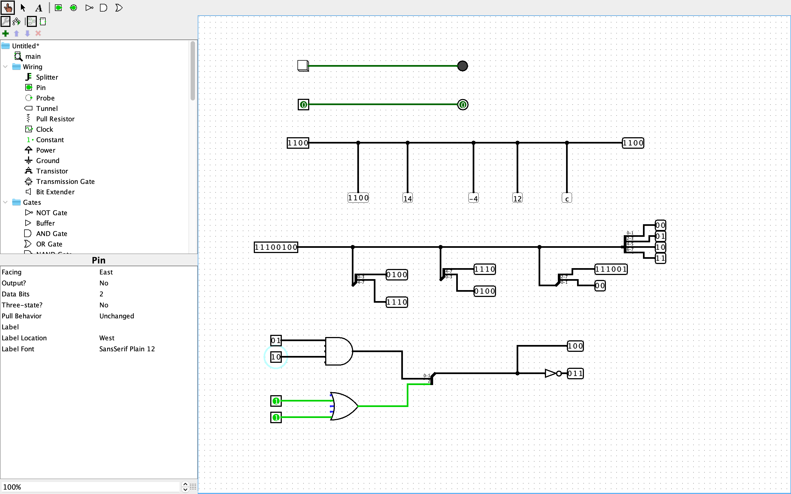
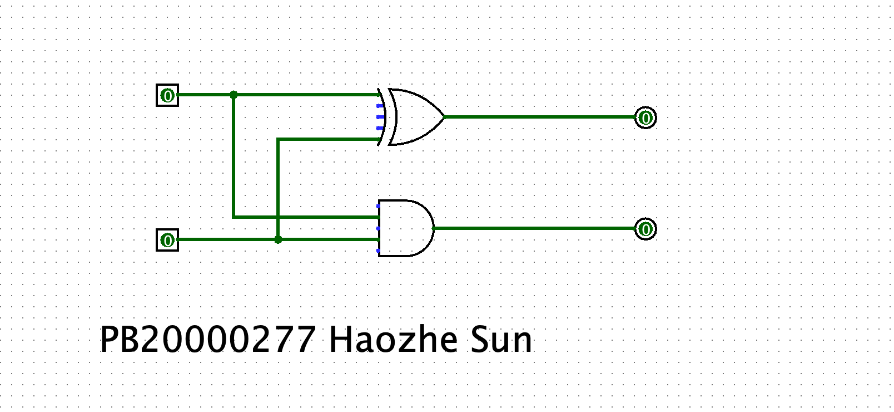
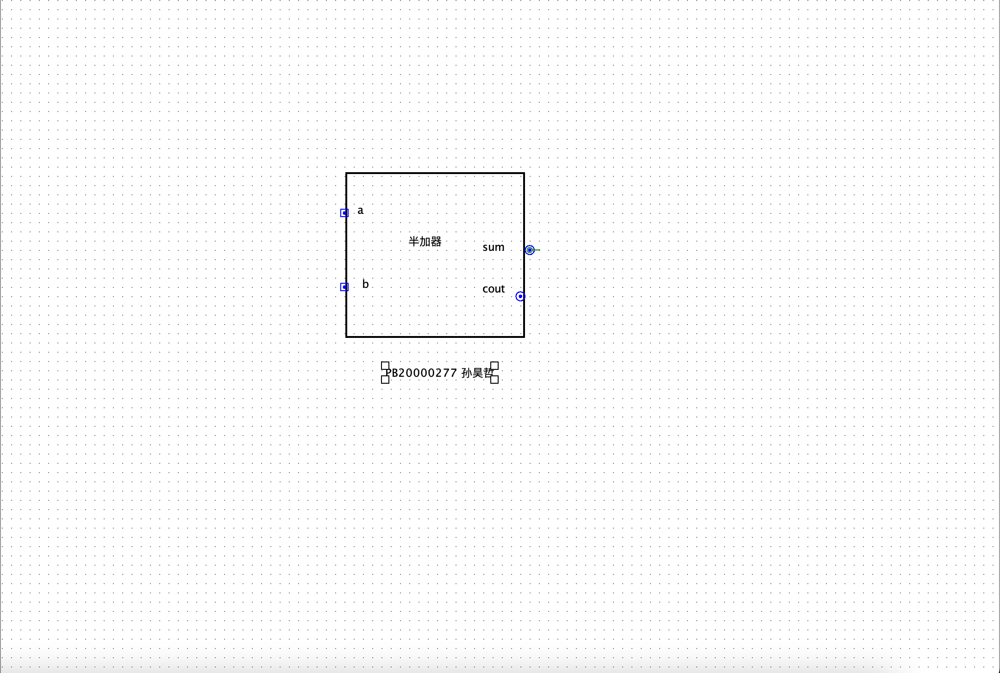
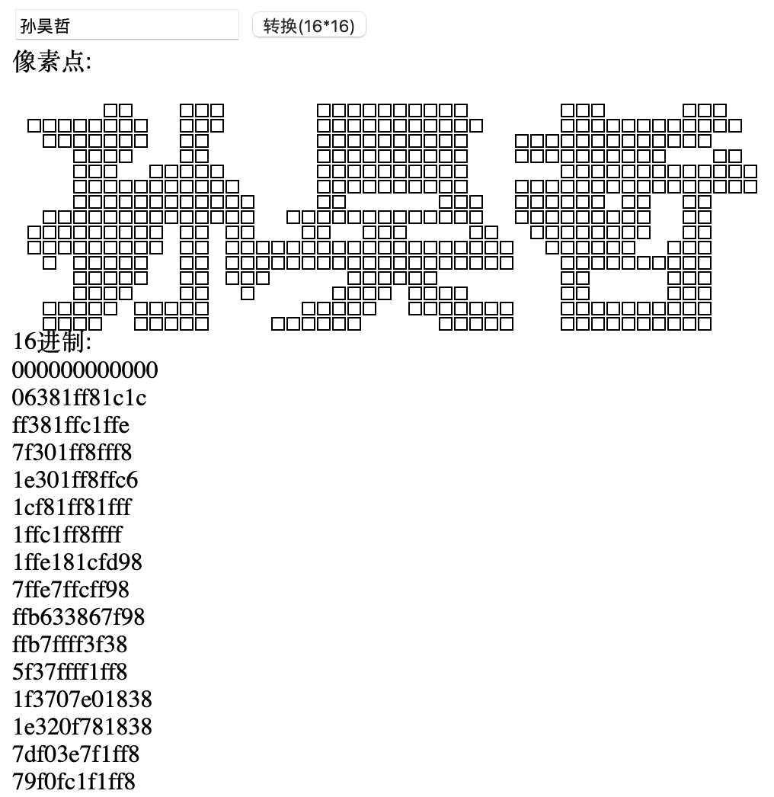
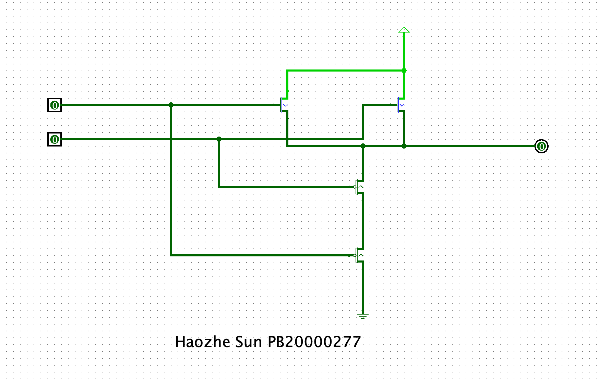
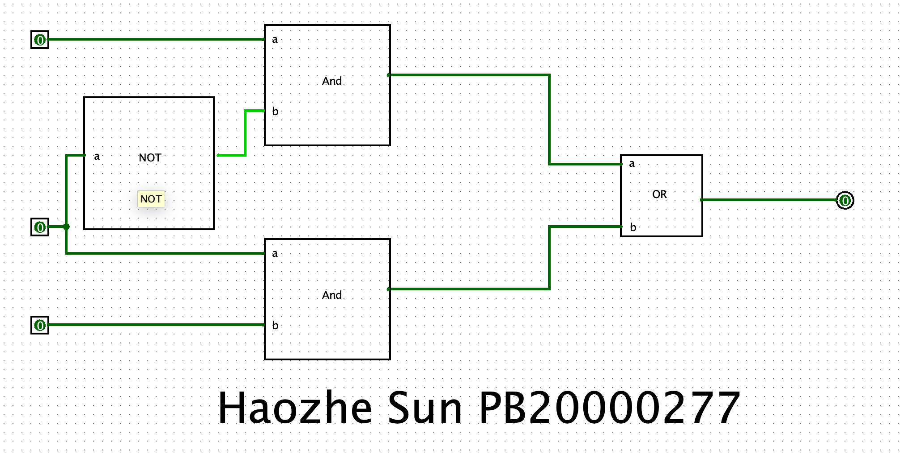
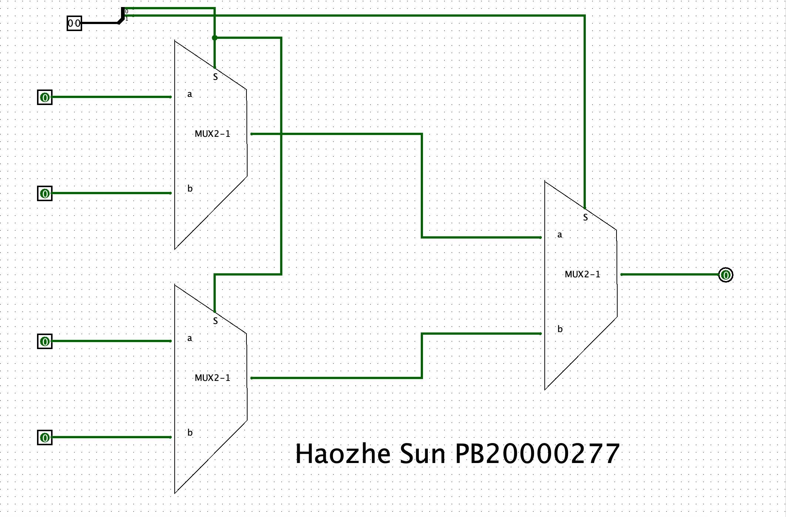

# Lab1实验报告

## 姓名 学号

孙昊哲 PB20000277

## 实验题目

Logisim入门

## 实验目的

1. 掌握Logisim的基本使用方法
2. 熟悉基本逻辑门的搭建方法
3. 复习与巩固理论课所学习的内容
4. 能够使用Logisim 搭建组合逻辑电路并进行仿真
5. 能够使用封装子电路并进行电路设计
6. 了解与掌握与门，或门和非门的组合逻辑电路的设计方法
7. 知道门部件最基本的组成部分

## 实验环境

macOS Monterey 12.6

Logism 2.7.1

openjdk 18.0.2.1

## 实验过程

1. 获取 Logisim 实验环境
   
   我使用的操作系统是macOS Monterey，所以找到对应的版本下载解压，需要注意的是提前安装好java环境

2. 熟悉 Logisim 界面
   
   观察logism的各个功能面板，具体的功能将在第三个步骤描述

3. 熟悉 Logisim 基本操作
   
   * 常见器件及使用方式：
     1. wire: 按钮，使用时将其在画布上连接即可，一根导线最多可以手 动控制拐一个弯，使用时软件会自动控制其走向。
     2. pin: 分为输入和输出接口，对应属性选项卡中的output。可以设 置Data Bits来改变端口的位宽，同时应改变facing使其朝向自然。
     3. probe: 探针，可以自动检测线上的数据，并以设置好的方法表示出 来。
     4. splitter: 分线器，Fan Out表示分成几部分，Bit Width表示输入位 宽，后面的每个Bit可取0到Fan Out-1个值，表示相应的位被分到那 一部分。
     5. Gates: 常见逻辑门。
     6. Button: 按钮。
     7. LED/LED Matrix: LED灯或点阵。
     8. Constant: 用于给输入端口赋常量值，程序重新打开时不会变。
     9. Power/Ground: 高电平或接地。
     10. Poke Tool: 给端口赋值。
   * 搭建相应的组件
      
4.  模块封装
   * 搭建好半加器
   * 点击相应的按钮，编辑好文字注释即可
   

   

## 实验练习

* ### T1

  1. 使用助教公布在群里的HTML文件，转换自己名字对应的二进制文件
   
  2. 选择LED MATRIX，并将其拖入画布中。因为我的名字有三个字，所以应当选择一个16*32的LED MATRIX和一个16*16的LED MATRIX，将其每端连接到常数上，分别选择32bit数据和16bit数据，并将其输入上对应的16进制数值
   

* ### T2

   1. 选择对应的7-Segment Disply，将其拖入画布中，将其每端连接到对应的驱动上
   2. 选择合适的驱动，使得其能够正常显示学号
   

* ### T3 T4
   1. 按照实验题目中的图示，搭建好对应的与门，或门和非门
      1. 与门
         
      2. 或门
          
      3. 非门
         
   2. 1bit位宽的2选1选择器
      一个2选1数据选择器有如下的布尔函数，$\scriptstyle A$和$\scriptstyle B$分别表示两个输入信号，$\scriptstyle S$为选择信号，$\scriptstyle Z$为输出信号，则有:
      $$Z=(A\cdot \overline {S})+(B\cdot S)$$

      那么我们可以画出如下的电路图:

      

      表示二选一选择器的电路图

      ***我们可以看出1bit位宽2选1选择器需要四个基本门***

   3. 有了1bit位宽2选1选择器，我们就可以搭建出一个1bit位宽4选1选择器，如下图所示:

      

      表示4选1选择器的电路图

   4. 有了1bit位宽4选1选择器，我们简单拓展即可搭建出一个2bit位宽4选1选择器，如下图所示:

      

      表示4bit位宽4选1选择器的电路图

      并且我们可以看出需要两个1bit位宽4选1选择器，并且一个1bit位宽4选1选择器需要三个1bit位宽2选1选择器，所以一共需要:
      $$4\times3\times2=24$$
      个基本门

## 总结与思考
1. 
  * 学习了logism的使用方法
  * 掌握了基本门的搭建方法
  * 学习了与门，或门和非门的组合逻辑电路的设计方法

2. 较为容易，但是重复度高，需要花费时间过长
3. 任务量较大
4. 减轻任务量
  