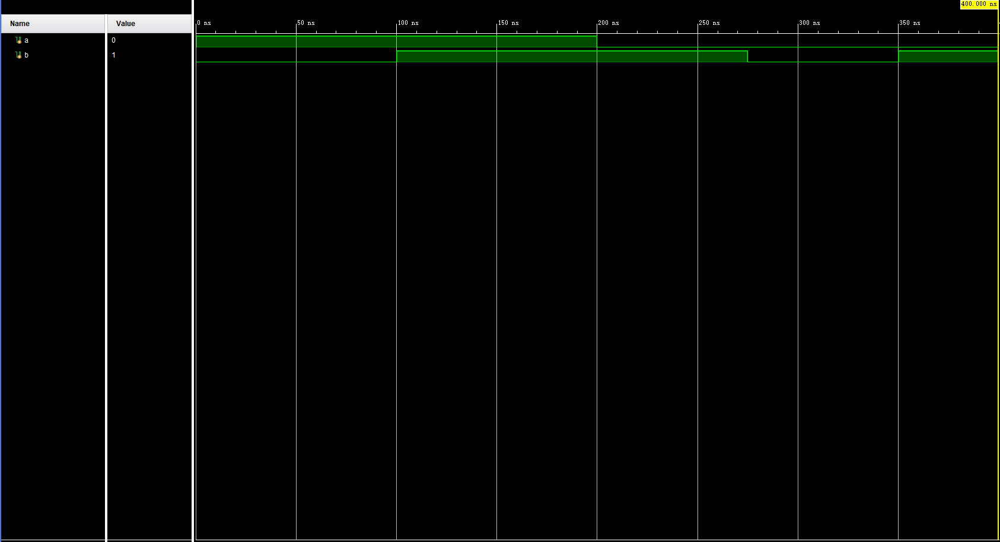
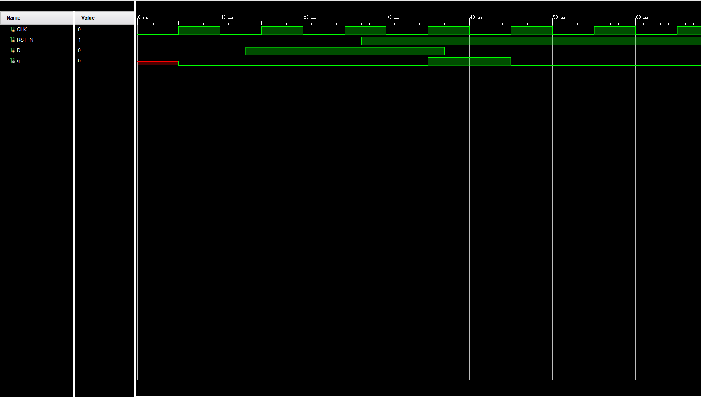
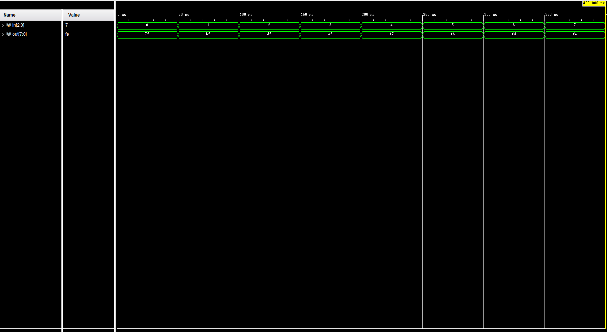

# Lab5

## 姓名 学号

PB20000277 孙昊哲

## 实验目的

* 熟悉 Vivado 软件的下载、安装及使用
* 学习使用 Verilog 编写仿真文件
* 学习使用 Verilog 进行仿真，查看并分析波形文件

## 实验环境

Windows 11

Vivado 2019

## 实验练习

### T1

我们根据图中波形编写好相应的仿真文件即可
```verilog
`timescale 1ns / 1ps

module T1();
reg a;
reg b;
initial 
begin
    a = 1;
    b = 0;
    #100 b = 1;
    #100 a = 0;
    #75 b = 0;
    #75 b = 1;
    #50 $finish;
end
endmodule
```



### T2

值得一提的是，我们的`clk`信号是这样生成的:

```verilog
initial CLK = 0;
always #5 CLK = ~CLK;
```

我们完成整个仿真文件

```verilog
`timescale 1ns / 1ps

module T2();
reg CLK, RST_N, D;
initial
begin
    CLK = 0;
    RST_N = 0;
    #27 RST_N = 1;
end
initial
begin
    D = 0;
    #13 D = 1;
    #24 D = 0;
end
always #5 CLK = ~CLK;
endmodule
```

我们在Vivado上完成仿真，值得注意的是，这个仿真是在完成T3一起进行的，单论T2的话，该仿真图中应该没有q的波形，



### T3

1. 新建一个`source`文件，在文件中输入题目中所给予的代码

2. 注意在仿真文件中新加一个例化，以及一个输出的变量
   ```verilog
   `timescale 1ns / 1ps
   
   module T2();
   reg CLK, RST_N, D;
   wire q;
   d_ff_r d_ff_r(CLK, RST_N, D, q);
   initial
   begin
       CLK = 0;
       RST_N = 0;
       #27 RST_N = 1;
   end
   initial
   begin
       D = 0;
       #13 D = 1;
       #24 D = 0;
   end
   always #5 CLK = ~CLK;
   endmodule
   ```

3. 最后我们得到了最终的仿真图
   

4. 观察仿真波形可以看出来，q仅在时钟上升沿发生变化，并且该电路是同步置位的

### T4

按照题目意思编写相应的3-8译码器

```verilog
`timescale 1ns / 1ps

module Decoder(
input [2:0] in,
output reg [7:0] out);
always@(*)
begin
case(in)
    3'b000:out=8'b0111_1111;
    3'b001:out=8'b1011_1111;
    3'b010:out=8'b1101_1111;
    3'b011:out=8'b1110_1111;
    3'b100:out=8'b1111_0111;
    3'b101:out=8'b1111_1011;
    3'b110:out=8'b1111_1101;
    3'b111:out=8'b1111_1110;
    default:out=8'b1111_1111;
endcase
end
endmodule
```

并且编写相应的仿真文件，该仿真文件可以遍历所有情况，

```verilog
`timescale 1ns / 1ps

module T4();
reg [2:0] in;
wire [7:0] out;
Decoder Decoder(in,out);
initial
begin
    in=3'b000; #50;
    in=3'b001; #50;
    in=3'b010; #50;
    in=3'b011; #50;
    in=3'b100; #50;
    in=3'b101; #50;
    in=3'b110; #50;
    in=3'b111; #50;
    $finish;
end
endmodule
```

仿真截图为：



## 总结与思考

1. 本次实验我们学习通过Vivado编写verilog仿真文件的方法，学会了在Vivado上设计与验证数字电路
2. 难易度中等
3. 任务量适中
4. 无
