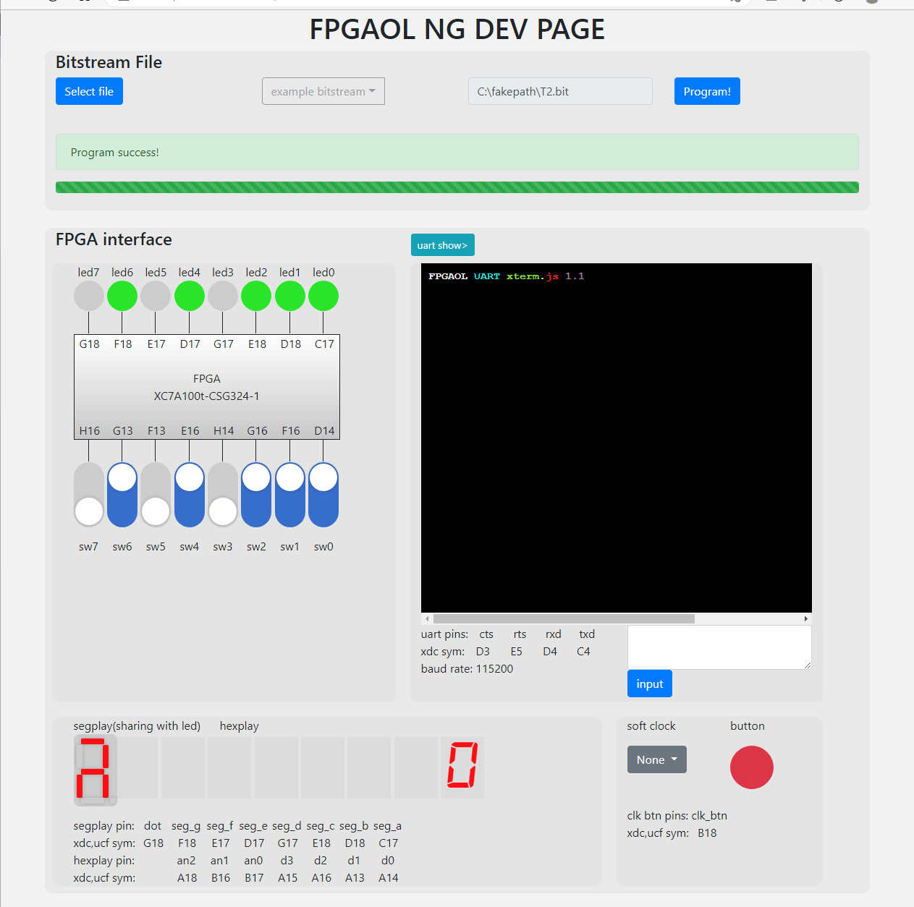

# Lab6

## 姓名 学号

孙昊哲 PB20000277

## 实验目的

* 了解 FPGA 工作原理 
* 了解 Verilog 文件和约束文件在 FPGA 开发中的作用 
* 学会使用 Vivado 进行 FPGA 开发的完整流程

## 实验环境

Windows 11

Vivado 2019

Logism

## 实验练习

### T1

我们根据实验文档中的方法正确画出电路图即可,


管脚文件：

```verilog
set_property -dict { PACKAGE_PIN E3 IOSANDARD LVCMOS33} [get_ports { clk }];
set_property -dict { PACKAGE_PIN B1 IOSANDARD LVCMOS33} [get_ports { a }];
```

### T2

只需要在提供的约束文件上将sw或者led的索引反过来即可：

```verilog
set_property -dict { PACKAGE_PIN E3    IOSTANDARD LVCMOS33 } [get_ports { clk }]; #IO_L12P_T1_MRCC_35 Sch=clk100mhz

## FPGAOL LED (signle-digit-SEGPLAY)

set_property -dict { PACKAGE_PIN C17   IOSTANDARD LVCMOS33 } [get_ports { led[0] }];
set_property -dict { PACKAGE_PIN D18   IOSTANDARD LVCMOS33 } [get_ports { led[1] }];
set_property -dict { PACKAGE_PIN E18   IOSTANDARD LVCMOS33 } [get_ports { led[2] }];
set_property -dict { PACKAGE_PIN G17   IOSTANDARD LVCMOS33 } [get_ports { led[3] }];
set_property -dict { PACKAGE_PIN D17   IOSTANDARD LVCMOS33 } [get_ports { led[4] }];
set_property -dict { PACKAGE_PIN E17   IOSTANDARD LVCMOS33 } [get_ports { led[5] }];
set_property -dict { PACKAGE_PIN F18   IOSTANDARD LVCMOS33 } [get_ports { led[6] }];
set_property -dict { PACKAGE_PIN G18   IOSTANDARD LVCMOS33 } [get_ports { led[7] }];


## FPGAOL SWITCH

set_property -dict { PACKAGE_PIN D14   IOSTANDARD LVCMOS33 } [get_ports { sw[7] }];
set_property -dict { PACKAGE_PIN F16   IOSTANDARD LVCMOS33 } [get_ports { sw[6] }];
set_property -dict { PACKAGE_PIN G16   IOSTANDARD LVCMOS33 } [get_ports { sw[5] }];
set_property -dict { PACKAGE_PIN H14   IOSTANDARD LVCMOS33 } [get_ports { sw[4] }];
set_property -dict { PACKAGE_PIN E16   IOSTANDARD LVCMOS33 } [get_ports { sw[3] }];
set_property -dict { PACKAGE_PIN F13   IOSTANDARD LVCMOS33 } [get_ports { sw[2] }];
set_property -dict { PACKAGE_PIN G13   IOSTANDARD LVCMOS33 } [get_ports { sw[1] }];
set_property -dict { PACKAGE_PIN H16   IOSTANDARD LVCMOS33 } [get_ports { sw[0] }];

set_property -dict { PACKAGE_PIN B18   IOSTANDARD LVCMOS33 } [get_ports { rst }];
```

实验结果：



### T3

我们首先展示32位代码：

```verilog
`timescale 1ns / 1ps
module counter_32(
input clk,
output reg [7:0]led);
reg [31:0] number;
always@(posedge clk)
begin
    led<=number[31:24];
    number<=number+1;
end
endmodule
```

30位代码与之完全类似：

```verilog
`timescale 1ns / 1ps
module counter_30(
input clk,
output reg [7:0]led);
reg [29:0] number;
always@(posedge clk)
begin
    led<=number[29:22];
    number<=number+1;
end
endmodule
```

我们仅需将代码的高位赋值给led即可，我们发现改成了32位后计数器的变化慢了$2^2$倍，而这也是很好理解的，我们增大了两位后相当于给原来的数字向左移动两位，使得变化后数字的前八位变化幅度变慢。

时钟信号的作用在于激励number值增大，起到一个类似于计时器的作用，每次clk变化就会导致了number值的变化。

## 总结与思考

1. 本次实验学习了如何烧写FPGA，理解了FPGA的原理和管脚约束的写法
2. 本次实验简单，没有改进建议
3. 无
