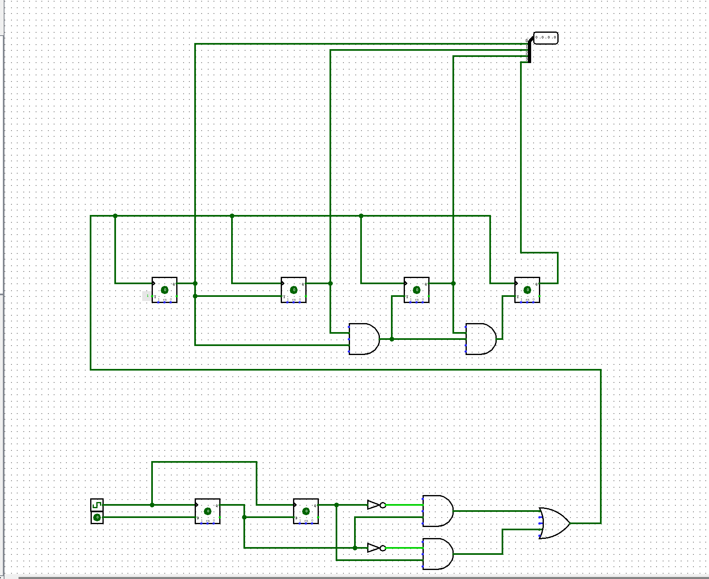
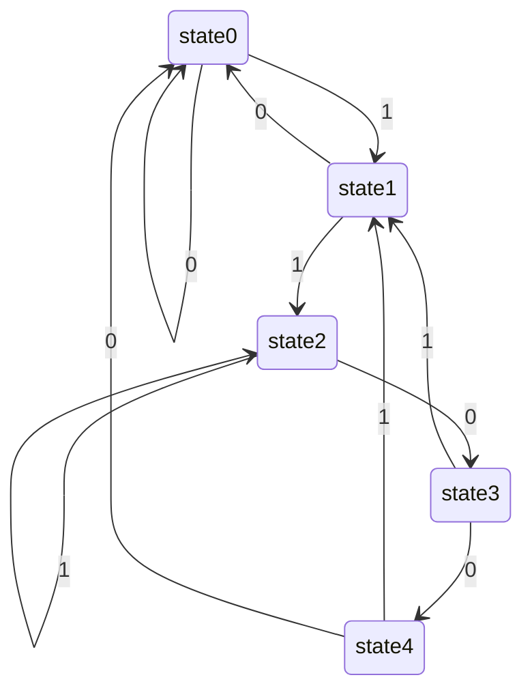

# Lab8

## 姓名 学号

孙昊哲 PB20000277

## 实验目的

* 进一步熟悉 FPGA 开发的整体流程 
* 掌握几种常见的信号处理技巧 
* 掌握有限状态机的设计方法 
* 能够使用有限状态机设计功能电路

## 实验环境

Windows11

Logism

## 实验题目

### T1

我们不难写出如下的verilog代码

```verilog
module T1(
input clk,rst,
output led);

reg [1:0]curr_state;
reg [1:0]next_state;

always@(*)
begin

		case(curr_state)
			2'b00:next_state=2'b01;
			2'b01:next_state=2'b10;
			2'b10:next_state=2'b11;
			2'b11:next_state=2'b00;
		endcase
end

always@(posedge clk or posedge rst)
begin
	if(rst)
		curr_state<=2'b00;
	else
		curr_state<=next_state;
end

assign led=(curr_state==2'b11)?2'b1:1'b0;
endmodule
```

### T2

我们可以使用Logism设计出下面的电路图，并且该电路图能够正确地完成试验任务



### T3

我们本次实验设计了如下的去毛刺和取边缘模块

```verilog
`timescale 1ns / 1ps

module signal_edge(
input clk,button,
output button_edge);

reg button_r1,button_r2;
always@(posedge clk)
    button_r1 <= button;

always@(posedge clk)
    button_r2 <= button_r1;
    
assign button_edge = button_r1 & (~button_r2);
endmodule
```

```verilog
module jitter_clr(
	input clk,
	input button,
	output button_clean
);
	reg [3:0] cnt;
	always@(posedge clk)
	begin
		if(button==1'b0)
			cnt <= 4'h0;
		else if(cnt<4'h8)
			cnt <= cnt + 1'b1;
	end
	assign button_clean = cnt[3];
endmodule
```

然后我们采用设计好的模块写出了下面的程序即可

```verilog
//top.v
module T3(
input sw, clk, btn, rst,
output reg [2:0]hexplay_an,
output reg [3:0]hexplay_data);
reg [7:0] data;
reg [32:0] hexplay_cnt;
wire button_edge;
wire button1;

always@(posedge clk or posedge rst) // always block
begin
    if (hexplay_cnt >= ( 20000000 / 8))
		hexplay_cnt <= 0;
	else
		hexplay_cnt <= hexplay_cnt + 1;
    if(rst)
        hexplay_cnt<=0;
end
always@(posedge clk) begin
	if (hexplay_cnt == 0)begin
		if (hexplay_an == 3'b1)
			hexplay_an <= 3'b0;
		else
			hexplay_an <= 3'b1;
	end
end

always@(posedge clk) begin
	if(hexplay_an==0)
        hexplay_data<=data[3:0];
    else
        hexplay_data<=data[7:4];
end

always@(posedge clk or posedge rst)
begin
if(button_edge)
        data<=sw?data+1:data-1;
if(rst)
        data<=8'h1f;
end

signal_edge signal_edge(clk,button1,button_edge);
jitter_clr jitter_clr(clk, btn, button1);
endmodule
```

### T4

我们设计了如下的状态转换图



其中状态4为接受状态。

那么我们可以继续采用T3所使用的模块设计出下面电路可以完成实验内容

```verilog
//state.v
module T4(
input clk, btn,sw,
output reg[2:0] hexplay_an,
output reg[3:0] hexplay_data
);

reg[2:0] current_state;
reg[2:0] next_state;
reg[3:0] num_series;
wire [23:0]data;
wire button_edge;
wire button1;
reg[3:0] prev1;
reg[3:0] prev2;
reg[3:0] prev3;
reg[3:0] prev4;
reg[32:0] hexplay_cnt;

parameter STATE0 = 3'b000;
parameter STATE1 = 3'b001;
parameter STATE2 = 3'b010;
parameter STATE3 = 3'b011;
parameter STATE4 = 3'b100;

signal_edge signal_edge(.clk(clk),.button(button1),.button_edge(button_edge));
jitter_clr jitter_clr(clk, btn, button1);
always@(posedge clk) begin
	if (hexplay_cnt >= (200000))
	   begin
		hexplay_cnt <= 0;
		if (hexplay_an == 5)
			hexplay_an <= 0;
		else
			hexplay_an <= hexplay_an + 1;
		end
		
	else
		hexplay_cnt <= hexplay_cnt + 1;
end


always@(*) begin
	case(hexplay_an)
		0: hexplay_data = data[3:0];
		1: hexplay_data = data[7:4];
		2: hexplay_data = data[11:8];
		3: hexplay_data = data[15:12];
		4: hexplay_data = data[19:16];
		5: hexplay_data = data[23:20];
		default:hexplay_data=4'b0000;
	endcase
end

always@(posedge clk)
begin    
    current_state <= next_state;				
end

always@(posedge button_edge)
begin
	if(button_edge)
    begin
        if(current_state == STATE4)    
            num_series = num_series + 1;    
		case(current_state)
			STATE0: if(sw == 0)
							next_state = STATE0;
					else 
							next_state = STATE1;
			STATE1: if(sw == 0)
							next_state = STATE0;
					else 
							next_state = STATE2;
			STATE2: if(sw == 0)
							next_state = STATE3;
					else 
							next_state = STATE2;
			STATE3: if(sw == 0)
							next_state = STATE4;
					else 
							next_state = STATE1;
            STATE4: if(sw == 0)
                            next_state = STATE0;
                    else    
                            next_state = STATE1;
			default: next_state = STATE0;
		endcase
    end
    else
        next_state = current_state;
end

always@(posedge button_edge)
begin
    if(button_edge)
    begin
        prev4 <= prev3;
        prev3 <= prev2;
        prev2 <= prev1;
        prev1 <={1'b0,1'b0,1'b0,sw};
    end
end
	
assign data[23:20]={1'b0,current_state};
assign data[19:16]=num_series[3:0];
assign data[15:0]={prev1, prev2, prev3, prev4};
 
endmodule
```

## 实验总结和思考

* 本次实验学习了如何取边缘以及去毛刺，并且我们成功设计了一系列状态机
* 本次实验较难
* 本次实验任务量较重
* 无