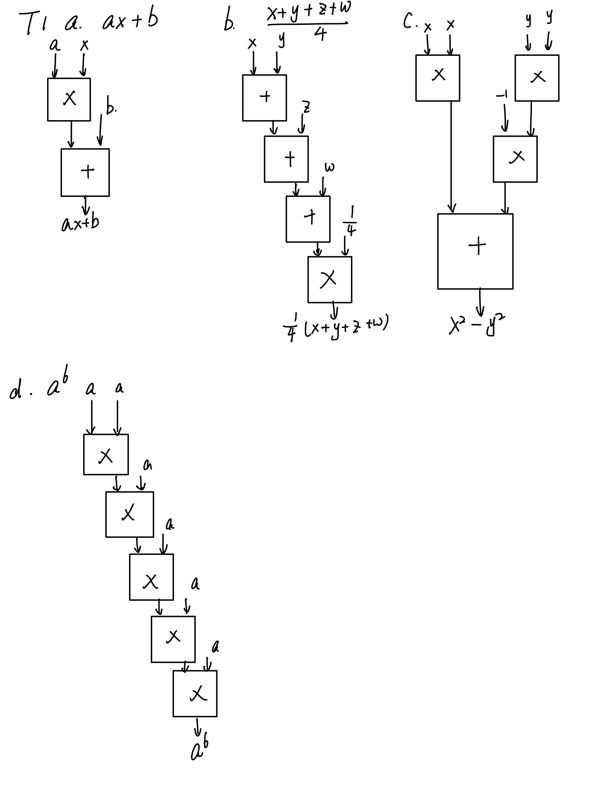
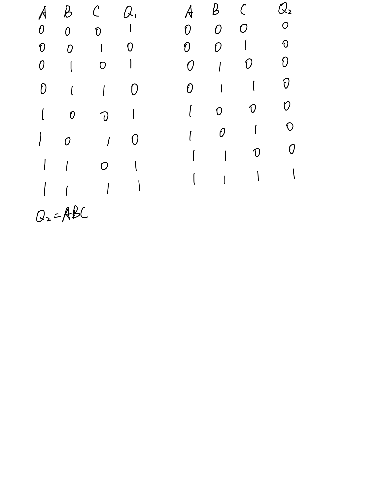
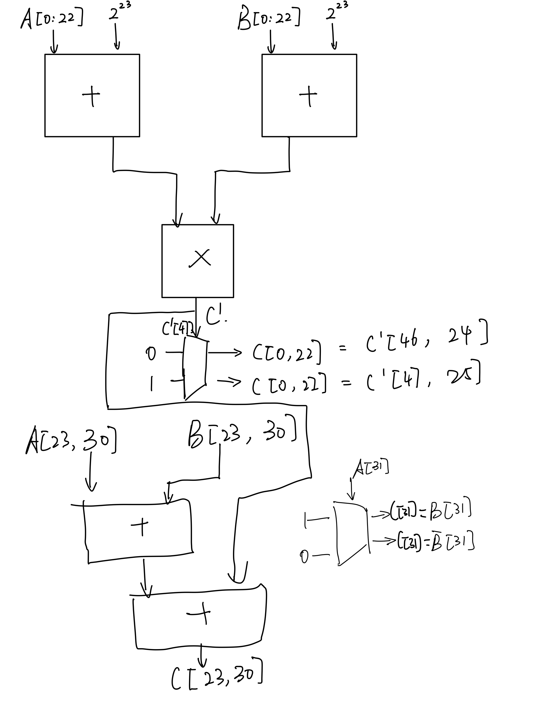

# HW1

1. T1

    

2. (1)

    a. 01100010

    b. 10010111

    (2)

    c. 66

    d. -17

3. a. 110100 DEC: -12

    b. 00100101 DEC: 37

    c. 0111 DEC: 7

    d. 1111 DEC: -1

4. a. 11101011

    b. 00011110

    c. 11110000

    d. 00000001

5. 0 10000001 00010011001100110011010

    若指数域全为1并且尾数域全为0，那么当符号位为1时表示负无穷，当符号位为0时，表示正无穷；若指数域全为1，但是尾数位不全为0，那么表示非数NaN。

6. 2022.5625
7. (1) a. 10000101

    b. 11111111

    c. 10101111

    (2) d. 1001101111111101

    e. 0101000000000111

8. T8

    

9. Eiho
10. 1.7976931348623157E+308
11. T11

    