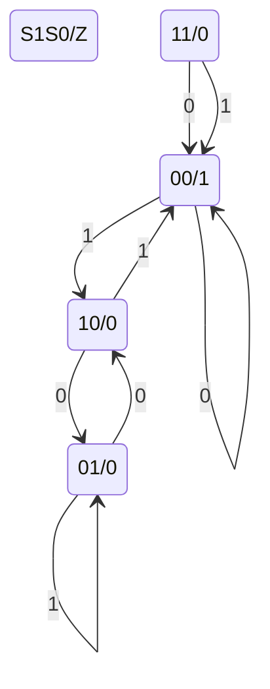

# HW3

## T1

(a). 

| $S_0$ | $S_1$ | $X$  | $Z$  | $S_0'$ | $S_1'$ |
| :---: | :---: | :--: | :--: | :----: | :----: |
|   0   |   0   |  0   |  1   |   0    |   0    |
|   0   |   0   |  1   |  0   |   1    |   0    |
|   0   |   1   |  0   |  0   |   1    |   0    |
|   0   |   1   |  1   |  0   |   0    |   1    |
|   1   |   0   |  0   |  0   |   0    |   1    |
|   1   |   0   |  1   |  1   |   0    |   0    |
|   1   |   1   |  0   |  1   |   0    |   0    |
|   1   |   1   |  1   |  1   |   0    |   0    |

(b).

## T2

Add the contents of register 2 to the contents of the register 1, and store them in the register 0;

If the result is equal or more than zero, the next instruction to execute will be the instruction at x3039.

## T3

(a). Opcode.

(b). Operands

## T4

Fetch (F) costs 100 cycles, and each of decode mn(D) the instruction, Fetch operand (FO), Execute (E) the instruction and Store the result (SR) costs only 1 cycle, so it will takes
$$
100+1+1+1+1=104
$$
Cycles.

## T5

The opcode will be 6bit,  the SR will be 6bit and the DR will be 6bit because $2^6=64$,.

Thus, the immediate number will be:
$$
32-6-6-6=14
$$
bit.

So, the range of the immediate number is 
$$
2^{13}\sim -2^{13}+1
$$

## T6

(a). The range of the immediate number will be increase. Because we need less bit giving to the registers, and thus we have 2 more bits give to the immediate number.

(b). We can get 1 more bit to the offset, thus we will improve our ability for addressing space.

(c). We can get 1 more bit to the offset, thus we can reach more address.

## T7

|      | fetch instruction | decode | evaluate address | fetch data | excute |
| :--: | :---------------: | :----: | :--------------: | :--------: | :----: |
|  PC  |        ALL        |        |                  |            |  JMP   |
|  IR  |        ALL        |        |                  |            |        |
| MAR  |        ALL        |        |                  |    ADD     |        |
| MDR  |        ALL        |        |                  |            |  ADD   |

## T8

## 

## T9

(a). 

$$
MAR:001
\newline
MDR:00110000
$$

(b). 

$$
MDR:00010101
$$

## T10

## 

## T11

(a). 8bit

(b). 7bit

(c). 3bit

## T12

(a). 
$$
\frac{1}{2\times10^{-9}}=5\times10^8
$$
(b). 
$$
\frac{1}{8}\times5\times10^8=6.25\times10^7
$$

## T13

* Fetch: Get instruction from memory. Load address of next instruction in the Program Counter.
* Decode: Find out what the instruction does.
* Evaluate Address: Calculate address of the memory location that is needed to process the instruction.
* Fetch Operands: Get the source operands (either from memory or register file).
* Execute: Perform the execution of the instruction.
* Store Result: Store the result of the execution to the specified destination.

