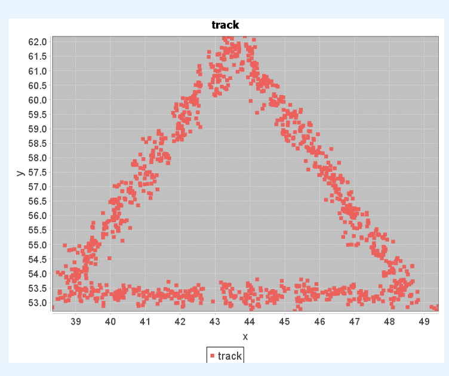

---
hide:
  - footer
---

# Haozhe Sun(孙昊哲)

[中文版](index_zh)

Undergraduate student in the University of Science and Technology of China

**Email**: expecto@mail.ustc.edu.cn

**Major**: Computer Science and Technology

**Research Interest**: High-precision location with RFID, Wireless Sensor Network

[:simple-github:](https://github.com/expecto347)
[:simple-zhihu:](https://www.zhihu.com/people/ha-ha-97-23-93)
[:simple-instagram:](https://www.instagram.com/expecto12312/)
[:simple-sinaweibo:](https://weibo.com/u/7413008957)

## Education

2020.6 - present: USTC (University of Science and Technology of China),Computer Science and Technology

2018.9 - 2020.6: Hefei No.6 High school

## Research Works

<figure markdown>
  
  <figcaption>Hign-precision location with RFID</figcaption>
</figure>

## Awards

2020.9: Scholarship
2019.10: China Olympic Physics Competition, 2nd Prize

## Publication

None
