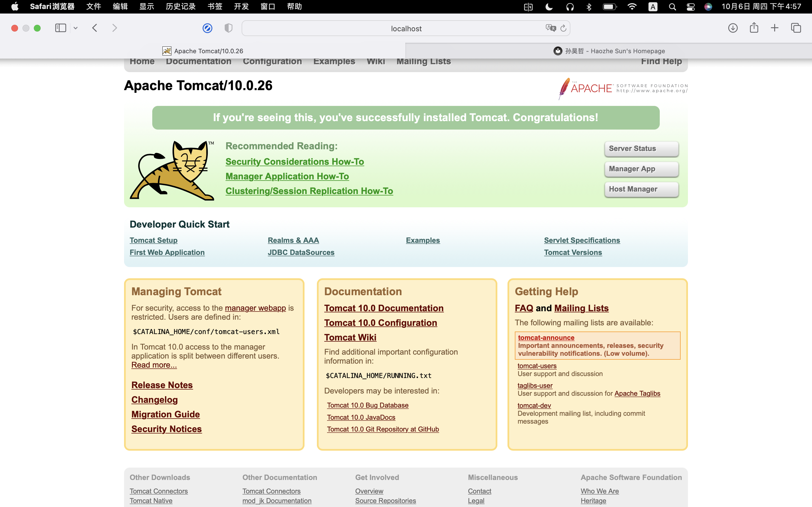

# Lab1实验报告

## 姓名 学号

孙昊哲 PB20000277

## 个人主页网址

http://home.ustc.edu.cn/~expecto

https://expecto347.github.io

请注意，请保证浏览器可以正常访问`fonts.gstatic.com`，以及`fonts.googleapis.com`。否则可能不能正常显示网页。

本此个人主页搭建使用了material mkdocs主题，借助了开源工具mkdocs和material mkdocs主题，以及github pages服务。

本次试验的HTML代码**并非**全部手写，而是使用了mkdocs工具生成，然后在生成的HTML代码上进行了一些修改。

## Tomcat截图

## Tomcat静态网页截图

