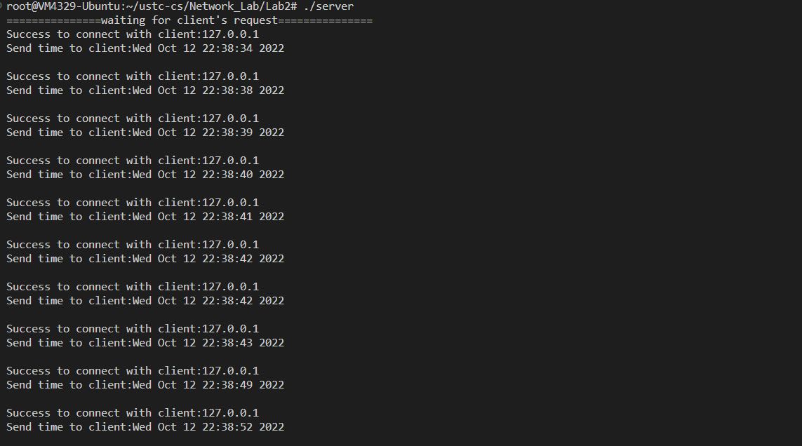
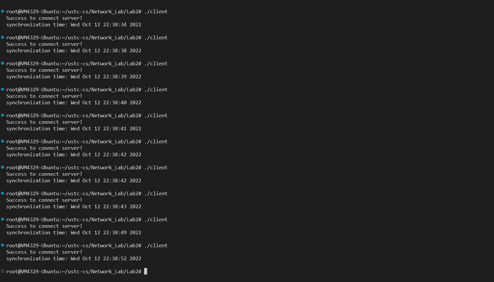

# Lab2实验报告

## 实验内容

服务器对时程序：一个服务器，多个客户端，客户端可以给服务器连接请求并返回服务器时间并对时。

## 实验平台和语言

Ubuntu 20.04.5 LTS (Focal Fossa) 64 bit

C Language

gcc version (Ubuntu 9.4.0-1ubuntu1~20.04.1) 9.4.0


## 实验过程

### 服务器端

程序流程图



#### 主要变量和函数的说明

1. create_socket()

    ```C
    int create_socket(){
        int sockfd;
        struct sockaddr_in servaddr;

        if((sockfd = socket(AF_INET, SOCK_STREAM, 0)) < 0){
            printf("create socket error: %s(errno: %d)\n", strerror(errno),errno);
            exit(0);
        }

        memset(&servaddr, 0, sizeof(servaddr));
        servaddr.sin_family = AF_INET;
        servaddr.sin_port = htons(DEFAULT_PORT);
        servaddr.sin_addr.s_addr = htonl(INADDR_ANY);

        if(bind(sockfd,(struct sockaddr*)&servaddr,sizeof(servaddr))==-1){
            printf("bind socket error:%s(errno:%d)\n",strerror(errno),errno);
            exit(0);
        }

        //Start to listen the socket
        if(listen(sockfd,10)==-1){
            printf("listen socket error:%s(errno:%d)\n",strerror(errno),errno);
            exit(0);
        }

        printf("===============waiting for client's request===============\n");
        
        return sockfd;
    }
    ```

    创建Socket接口，绑定至DEFAULT_PORT端口，开始监听。绑定时，需要将IP地址转换为网络字节序，端口号也需要转换为网络字节序。选择合适的网络协议——TCP/IP协议。

2. wait_client(int listen_socket)
   ```C
    int wait_client(int listen_socket){
        int connfd;
        struct sockaddr_in cliaddr;
        socklen_t clilen;
        char buff[MAXLINE];
        int n;

        while(1){
            clilen = sizeof(cliaddr);
            if((connfd = accept(listen_socket, (struct sockaddr*)&cliaddr, &clilen))==-1){
                printf("accept socket error:%s(errno:%d)\n",strerror(errno),errno);
                continue;
            }

            //print the client's information
            printf("Success to connect with client:%s\n",inet_ntoa(cliaddr.sin_addr));
            return connfd;
        }
    }
    ```

    该程序等待客户端的连接请求，当有客户端连接时，返回连接套接字。

3. send_time()
    ```C
    void send_time(int listen_socket, int client_socket){
        char *buff;
        int n;
        time_t ticks;

        time(&ticks);
        buff = ctime(&ticks);

        printf("Send time to client:%s\n",buff);
        if(send(client_socket, buff, strlen(buff) + 1, 0) == -1) perror("send error");
        close(client_socket);
    }
    ```

    该程序将服务器的时间发送给客户端，并关闭连接套接字。

4. main()

    ```C
    int main(int argc, char **argv){
        int listen_socket = create_socket();

        int p = fork();
        if(p == -1){
            printf("创建子进程失败\n");
        }
        else if(p > 0){
            char c;
            c = getchar();
            if(c == 'q'){
                printf("再见！\n");
                close(listen_socket);
                exit(0);
            }
        }
        else{
            while(1){
                int client_socket = wait_client(listen_socket); //多进程服务器，可以创建子进程来处理，父进程负责监听。
                int pid = fork();
                if(pid == -1){
                    perror("fork");
                    break;
                }
                if(pid > 0){ //父进程只负责监听
                    close(client_socket);
                    continue;
                }
                if(pid == 0){
                    close(listen_socket);
                    send_time(listen_socket, client_socket);
                    break;
                }
            }
        }
    }
    ```

    需要注意的是我们的服务器是多进程的，父进程负责监听，子进程负责处理客户端的请求。当父进程接收到客户端的连接请求时，会创建一个子进程来处理客户端的请求，父进程继续监听。当子进程处理完客户端的请求后，会关闭连接套接字，然后退出。

    并且我们创建了一个进程监听串口的输入，当用户输入q时，服务器会关闭。

### 客户端

客户端程序较为简单，创建一个socket，连接到服务器，然后接收服务器发送的时间信息。并将时间信息打印出来即可

```C
int main(){
    int client_socket = socket(AF_INET, SOCK_STREAM, 0); //Set up a socket
    if(client_socket == -1){
        perror("socket");
        return -1;
    }

    struct sockaddr_in addr;
    memset(&addr, 0, sizeof(addr));
    
    addr.sin_family = AF_INET;
    addr.sin_port = htons(DEFAULT_PORT);
    addr.sin_addr.s_addr = htonl(INADDR_ANY);
    inet_aton("127.0.0.1", &(addr.sin_addr));
    
    int addrlen = sizeof(addr);
    int listen_socket = connect(client_socket, (struct sockaddr *)&addr, addrlen);  //Connect to the server
    if(listen_socket == -1){
        perror("connect");
        return -1;
    }
    
    printf("Success to connect server!\n");

    char buf[SIZE];

    if(recv(client_socket, buf, SIZE, 0) == -1){
        perror("recv");
        return -1;
    }
    
    printf("synchronization time: %s\n", buf);

    close(listen_socket);
    
    return 0;
}
```

### 程序操作过程

1. 编译服务器端程序

    ```shell
    gcc -o server server.c
    ```

2. 编译客户端程序

    ```shell
    gcc -o client client.c
    ```

3. 运行服务器端程序

    ```shell
    ./server
    ```

4. 运行客户端程序

    ```shell
    ./client
    ```

即可完成授时操作，并且我们可以在服务器端输入q来关闭服务器。

值得注意的是，我们编写的服务器是多进程的，也就是意味着它可以满足多个客户端的请求。当我们运行多个客户端程序时，服务器端会为每个客户端创建一个子进程来处理。

请确保DEFAULT_PORT端口没有被占用。该端口可以在``DEFAULT_PORT.h``中修改。当前的端口为：19999

## 实验结果

### 服务器端



### 客户端



可以从图中看出成功完成了授时同步！

