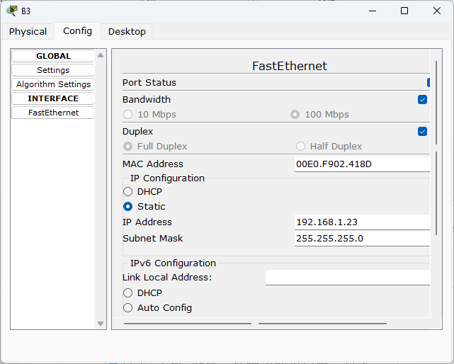
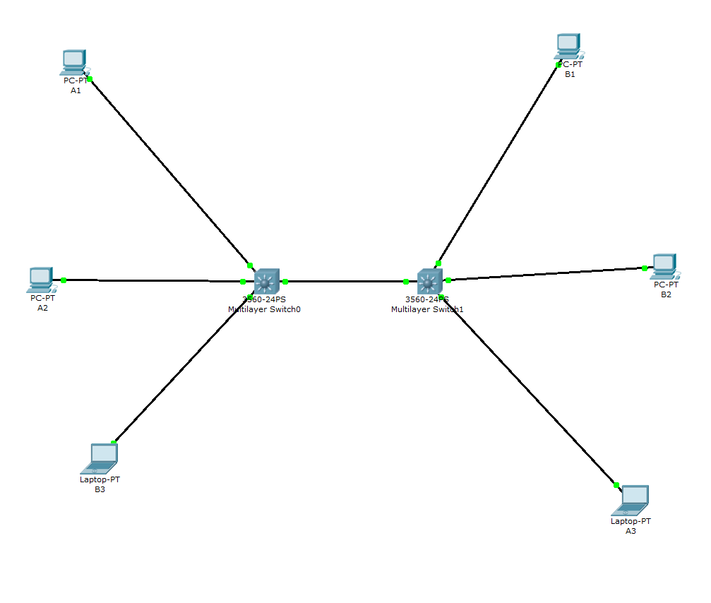
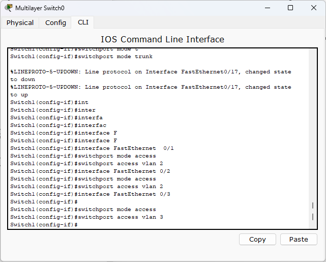
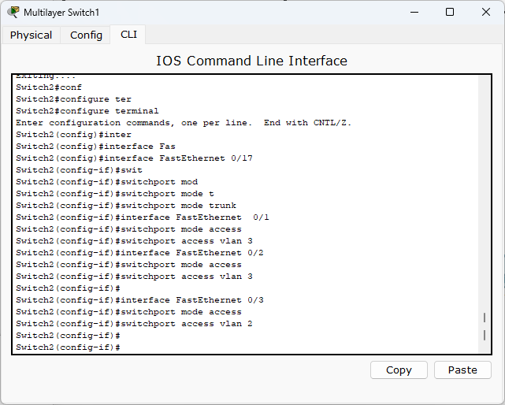
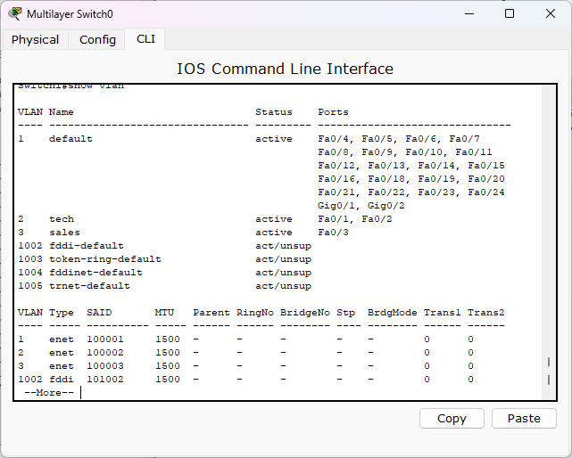
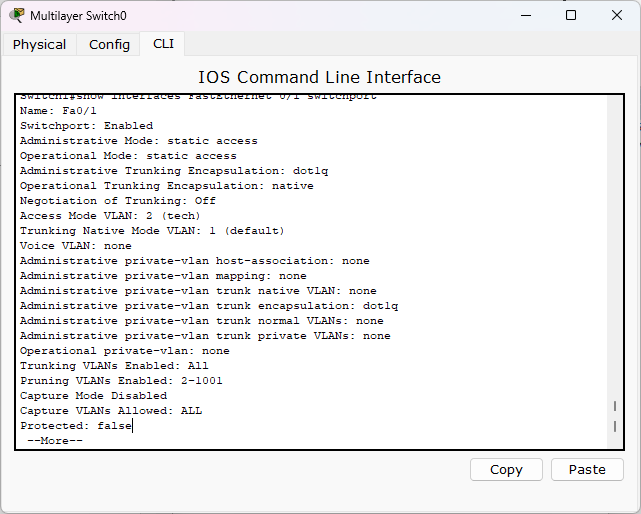
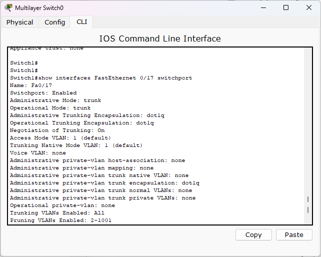
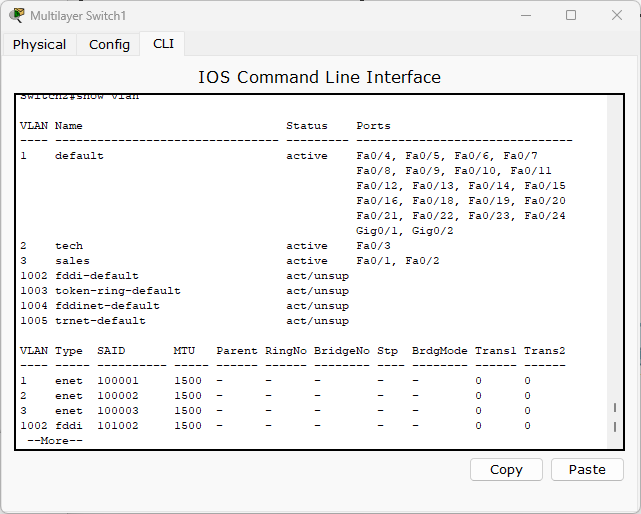
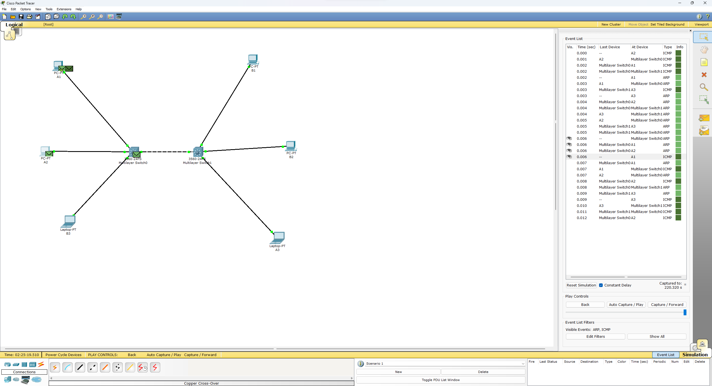
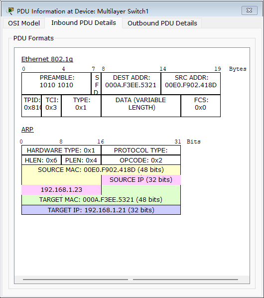

# Lab4

## 姓名 学号

孙昊哲 PB20000277

## 实验目的

* 了解VLAN交换机的特性与应用场合

* 掌握VLAN交换机组网的基本配置方法

## 实验环境

模拟软件Cisco Packet Tracer 5.2

## 实验过程

1. 按照下面的图表正确配置与连接实验设备
   |      Switch1      |         Switch1          |      Switch2      |         Switch2          |
   | :---------------: | :----------------------: | :---------------: | :----------------------: |
   |       From        |            To            |       From        |            To            |
   | FastEthernet 0/1  |            A1            | FastEthernet 0/1  |            B1            |
   | FastEthernet 0/2  |            A2            | FastEthernet 0/2  |            B2            |
   | FastEthernet 0/3  |            B3            | FastEthernet 0/3  |            A3            |
   | FastEthernet 0/17 | Switch2,FastEthernet0/17 | FastEthernet 0/17 | Switch1,FastEthernet0/17 |

主机IP地址配置

| 主机 |    IP地址    |   子网掩码    |
| :--: | :----------: | :-----------: |
|  A1  | 192.168.1.11 | 255.255.255.0 |
|  A2  | 192.168.1.12 | 255.255.255.0 |
|  A3  | 192.168.1.13 | 255.255.255.0 |
|  B1  | 192.168.1.21 | 255.255.255.0 |
|  B2  | 192.168.1.22 | 255.255.255.0 |
|  B3  | 192.168.1.23 | 255.255.255.0 |

如下图的方式配置好每台终端的IP地址

问题1：

每台主机都可以相互Ping通，因为我们还没有正确设置VLAN

2. 在交换机中我们修改Hostname并且进入CLI窗口
   在switch1上创建VLAN

   

​	在Switch2上创建VLAN

​	

3. 查看VLAN配置的结果

   查看Switch1的配置结果
   
* show vlan 

* show interfaces FastEthernet 0/1 switchport 

* show interfaces FastEthernet 0/3 switchport

* show interfaces FastEthernet 0/17 switchport 

同理，Switch2也同样地配置即可，我们就不把配置图片全部放出来了

问题二：

Ping之后发现只有在同一个部门的可以Ping通，因为我们成功设置了VLAN，只有在同一个局域网中的设备才能够Ping通，避免了冲突

4. VLAN对广播包的处理

   * 在第一次的命令的运行过程中，在经过交换机后需要交换各自的MAC地址表，即ARP消息
   * 在交换过各自的MAC地址表后同一个VLAN下的设备后发送ICMP类型信息，即可Ping通，仿真过程如下图所示：
     

   * 并且在第二次Ping的过程中交换过MAC地址表的设备不需要重新交换地址表，直接发送ICMP消息即可

5. 观察802.1Q帧封装信息，解释其中的含义
   首先列出802.1Q的含义

> IEEE 802.1Q标准对Ethernet帧格式进行了修改，在源MAC地址字段和协议类型字段之间加入4字节的802.1Q Tag。VLAN帧最小帧长为64字节。

| 字段                | 长度        | 含义                                                         |
| ------------------- | ----------- | ------------------------------------------------------------ |
| Destination address | 6字节       | 目的MAC地址。                                                |
| Source address      | 6字节       | 源MAC地址。                                                  |
| Type                | 2字节       | 长度为2字节，表示帧类型。取值为0x8100时表示802.1Q Tag帧。如果不支持802.1Q的设备收到这样的帧，会将其丢弃。 |
| PRI                 | 3比特       | Priority，长度为3比特，表示帧的优先级，取值范围为0～7，值越大优先级越高。用于当阻塞时，优先发送优先级高的数据包。如果设置用户优先级，但是没有VLANID，则VLANID必须设置为0x000。 |
| CFI                 | 1比特       | CFI (Canonical Format Indicator)，长度为1比特，表示MAC地址是否是经典格式。CFI为0说明是标准格式，CFI为1表示为非标准格式。用于区分以太网帧、FDDI（Fiber Distributed Digital Interface）帧和令牌环网帧。在以太网中，CFI的值为0。 |
| VID                 | 12比特      | LAN ID，长度为12比特，表示该帧所属的VLAN。在VRP中，可配置的VLAN ID取值范围为1～4094。0和4095协议中规定为保留的VLAN ID。三种类型：Untagged帧：VID 不计Priority-tagged帧：VID为 0x000VLAN-tagged帧：VID范围0～4095三个特殊的VID：0x000：设置优先级但无VID0x001：缺省VID0xFFF：预留VID |
| Length/Type         | 2字节       | 指后续数据的字节长度，但不包括CRC检验码。                    |
| Data                | 42~1500字节 | 负载（可能包含填充位）。                                     |
| CRC                 | 4字节       | 用于帧内后续字节差错的循环冗余检验（也称为FCS或帧检验序列）。 |

我们观察下面的802.1Q帧

验证了我们的表格中所述的内容

6. 

   |                           | Switch2 trunk | Switch2 dynamic desirable | Switch2 dynamic auto |
   | :-----------------------: | :-----------: | :-----------------------: | :------------------: |
   |       Switch1 trunk       |     可以      |           可以            |         可以         |
   | Switch1 dynamic desirable |     可以      |           可以            |         可以         |
   |   Switch1 dynamic auto    |     可以      |           可以            |        不可以        |

   

|                           | Switch2 trunk | Switch2 dynamic desirable | Switch2 dynamic auto |
| :-----------------------: | :-----------: | :-----------------------: | :------------------: |
|       Switch1 trunk       |     可以      |          不可以           |        不可以        |
| Switch1 dynamic desirable |      无       |            无             |          无          |
|   Switch1 dynamic auto    |      无       |            无             |          无          |
