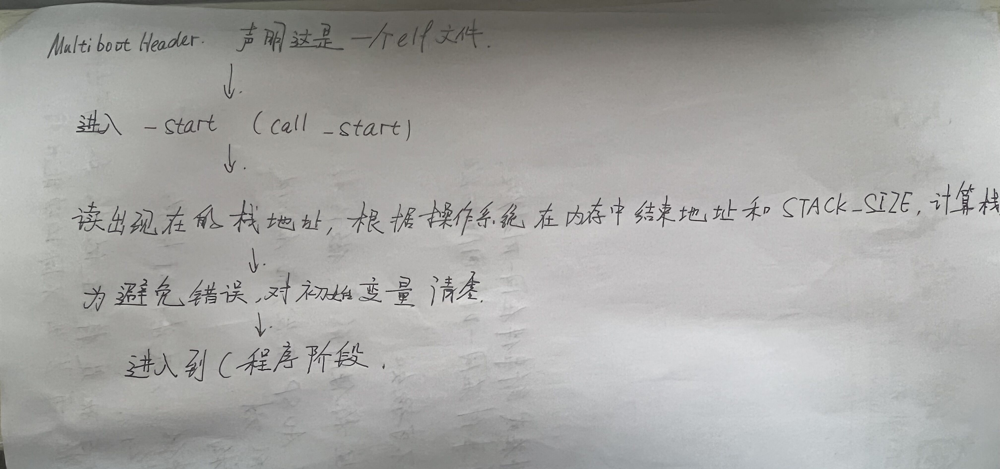

# Lab2实验报告

## 1.给出软件的框图，并加以概述


* 本次实验硬件层面有VGA显示器以及UART串口输出两大部分，通过一些汇编语言给C语言调用，在myPrint[kf]模块中实现将VGA输出以及串口输出的模块化，用于给上层系统调用；
* 在MultibootHeader启动段中引用了少量的汇编进行对系统的初始化，堆栈的处理，使得系统进入C语言层面；
* 测试用例通过myMain程序并通过移植的vsprintf对字符串进行处理，并且最终调用内核提供的函数接口，进行VGA输出。

## 2. 说明主流程及其实现，画出流程图



* 首先通过MultibootHeader规定的头文件，声明这是一个ELF文件；
* 进入start段后，正确初始化C语言的堆栈；
* 并且对各个变量进行初始化操作；
* 正式进入到C语言阶段。

## 3. 说明主要功能模块及其实现

```C
#include "io.h"
#include "vga.h"

#define VGA_BASE 0xB8000 // vga 显存起始地址
#define VGA_SCREEN_WIDTH 80 // vga 屏幕宽度（可容纳字符数）
#define VGA_SCREEN_HEIGHT 25 // vga 屏幕高度

#define CURSOR_LINE_REG 0xE // 行号寄存器
#define CURSOR_COL_REG 0xF // 列号寄存器
#define CURSOR_INDEX_PORT 0x3D4 // 光标行列索引端口号
#define CURSOR_DATA_PORT 0x3D5 // 光标数据端口号

/*该函数更新指针的位置*/
void update_cursor(unsigned short int pos){
    outb(0x3D4, 0x0F); //指明0x3D5与0xF交互
    outb(0x3D5, (unsigned short int) (pos & 0xFF)); //将低8位数据存入寄存器
    outb(0x3D4, 0x0E); //指明0x3D5与0xE交互
	outb(0x3D5, (unsigned short int) ((pos >> 8) & 0xFF)); //将高8位数据存入寄存器
}
/*该函数返回VGA中16位pos的值*/
unsigned short int get_cursor_position(void)
{
    unsigned short int pos = 0;
    outb(0x3D4, 0x0F);
    pos |= inb(0x3D5); //获取低8位数据
    outb(0x3D4, 0x0E);
    pos |= ((unsigned short int)inb(0x3D5)) << 8; //获取高8位数据
    return pos;
}

/* 滚屏，vga 屏幕满时使用。丢弃第一行内容，将剩余行整体向上滚动一行*/
void scroll_screen(void) {
    unsigned char *videobuf = (unsigned char*)0xb8000; //定义一个指针指向VGA显存地址
	unsigned short int pos,pos_1;
	int x,y;
	
	for(y=0;y<(VGA_SCREEN_HEIGHT - 1);y++){
		for(x=0;x<VGA_SCREEN_WIDTH;x++){
			pos = y * VGA_SCREEN_WIDTH + x; //计算16位pos值
			pos_1 = (y + 1) *VGA_SCREEN_WIDTH + x;
			videobuf[pos*2 + 0] = videobuf[pos_1*2 + 0]; //每个字符向上移动一行
			videobuf[pos*2 + 1] = videobuf[pos_1*2 + 1]; //每个字符颜色向上移动一行
		}
	}
	for(x=0;x<VGA_SCREEN_WIDTH;x++){
		pos = (VGA_SCREEN_HEIGHT-1)*(VGA_SCREEN_WIDTH) + x; //计算最后一行的pos值
		videobuf[pos*2] = ' ';
		videobuf[pos*2 + 1] = (unsigned char)0x7;
	}
}

/* 向 vga 的特定光标位置 pos 输出一个字符*/
void put_char2pos(unsigned char c, unsigned short int color, unsigned short int pos) {
    unsigned char *videobuf = (unsigned char*)0xb8000; //定义一个指针指向VGA显存地址
    videobuf[pos*2 + 0] = c; //写入字符
	videobuf[pos*2 + 1] = (unsigned char)color; //写入颜色
}
/* ========= 以下函数接口禁止修改 ========= */

/* 清除屏幕上所有字符，并将光标位置重置到顶格*/
void clear_screen(void) {
    int x,y;
    unsigned short int pos;
	
    for(x=0;x<VGA_SCREEN_WIDTH;x++)
	{
        for(y=0;y<VGA_SCREEN_HEIGHT;y++)
		{
			pos = y * VGA_SCREEN_WIDTH + x; //计算16位pos值
            put_char2pos(' ', 0x7, pos);
        }
    }
    update_cursor(0);//将指针移动到顶格
}

/* 向 vga 的当前光标位置输出一个字符串，并移动光标位置到串末尾字符的下一位
 * 如果超出了屏幕范围，则需要滚屏
 * 需要能够处理转义字符 \n */
void append2screen(char *str, int color) {
	unsigned short int pos;
    pos = get_cursor_position(); //获取指针位置
	for(int n=0;str[n]!='\0';n++){
  /*如果字符串是'\n'那么就进行换行操作*/
  if(str[n] == '\n'){
   int y = pos / VGA_SCREEN_WIDTH; //求出现在指针的行数
   /*如果在最后一行，进行滚动屏幕以及换行操作*/
   if(y == (VGA_SCREEN_HEIGHT - 1)){
    scroll_screen();
    pos = (VGA_SCREEN_HEIGHT - 1) * (VGA_SCREEN_WIDTH);
    update_cursor(pos);
   }
			else{
				pos = (y+1) * VGA_SCREEN_WIDTH; //更改指针到下一行首字符处
				update_cursor(pos);
			}
		}
		else{
			/*如果光标位置在VGA输出屏最后一个那么滚动屏幕并且将光标更新到最后一行第一格*/
			if(pos == (VGA_SCREEN_HEIGHT * VGA_SCREEN_WIDTH - 1)){
				put_char2pos(str[n], (unsigned short int)color, pos);
				scroll_screen();
				update_cursor((VGA_SCREEN_HEIGHT-1) * VGA_SCREEN_WIDTH);//更新光标位置
			}
			else{
				pos = get_cursor_position();
				put_char2pos(str[n], (unsigned short int)color, pos);
				pos++;
				update_cursor(pos); //更新光标位置
			}
		}
	}
}
```

* 这是VGA输出模块的代码段，首先我们为了后续方便起见，首先定义了一些VGA参数方便后续使用；
* 我们首先定义了三个函数，供后面调用：
  * `update_cursor(unsigned short int pos)` 该函数实现了