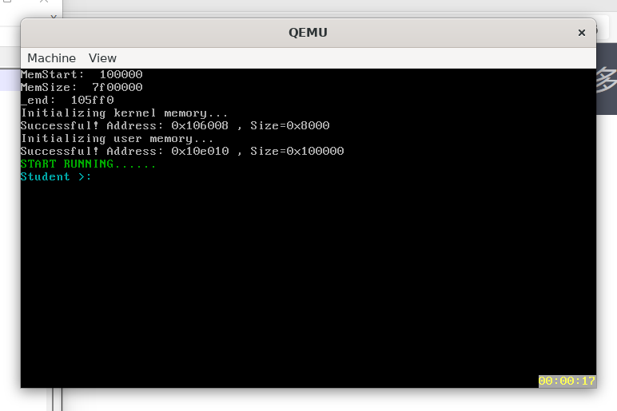

# Lab4实验报告

## 1. 软件框图

1. 本次实验与之前实验相仿，首先进入从multibootHeader进入OS_Start，然后再运行相关编写的指令；
2. 值得指出的是本次实验在操作系统正式启动前加入了内存初始化的步骤，分别初始化了内核内存与用户内存，将用户内存与内核内存相隔离；
3. 系统正式启动后，可以在shell()程序中调用各种用户程序；

## 2. 源代码说明

1. 本次实验着重编写了`../myOS/kernel/mem`部分的内容；

2. `pMemInit`模块在系统启动的时候检测电脑的内存情况，统计出总共有多少内存，并且在检测完成后调用相关的接口，初始化内存并且对内核内存和用户内存分别初始化；

3. `dPartition`模块进行了写了动态分配的相关代码，本次实验采用的是`FirstFit` 逻辑，该模块是本次实验工作量最大的模块，需要进行大量地Debug，后期bug也重点集中在这一部分，该模块编写了动态内存分配初始化，动态内存分配与释放逻辑，需要考虑到许多极端情况；

4. `eFPartition`模块编写了固定地址分配的相关程序，该模块提供了`Init`，`Malloc`以及`Free`的相关指令，该模块较为简单，在代码中有详细的注释，就不在此赘述；

5. `malloc`模块进行了相关内核以及用户态的`malloc`和`free`指令的编写；

6. `MemTestCase`我们添加了两条指令用来测试相关的`Umalloc`和`Ufree`指令是否工作正常

7. `shell`部分我们完善了`addNewCmd`指令，该函数用于添加新的自定义的应用程序到我们的shell当中；

8. 值得一提的是，我们在OS_Start模块更改了相关的程序，我们加入了初始化内核内存以及用户内存的步骤，我们将内核内存与用户内存分开管理，更利于我们管理内存；

## 3. 程序编译以及运行结果

我们编译以及运行的指令是由老师提供的source2img.sh文件，下面依次解释各个测试用例的作用：
  
1.初始化系统：

我们进入系统，首先检测可用内存的大小，从1M的地址开始检测，以0x1000为步长测试，发现系统可用的内存大小是`7f00000`；然后我们再初始化内核内存，我们为内核内存初始化了`0x8000`大小，即8k的大小，创建成功后去创建了用户内存，用户内存可以在UserApp的编写中自行设定，本次实验我们设定为1M内存；然后我们的系统就可以正式启动了；

2.testMalloc1

该测试用例申请了两个buffer，分别是19字节和24字节，并且测试了对他们写入相关字节，发现可以正常写入，并且读取成功，那么就说明我们申请的相关内存是正确的；
，符合预期；

3.testMalloc2

该测试用例与上个测试用例相仿，申请了两个9字节和24字节的内存地址，并进行了相仿的实验，写入和读取均正常，并且我们可以注意到这次申请的地址与上例中的地址相同，这说明了我们在上例中free的操作运行正常；

4.testeFP

>注意：EEB代表的是当前空闲的可用的memBlock，并且我们在每次分配后将当前的EEB打印下来,方便后期调试

该测试用例测试了等大小分配机制，因为该测试用例在VGA上不能完整展示，我们使用了UART上的截图，可以看出来我们首先初始化了一个具有4个内存块的memBlock；其中每个memBlock可用的字节数为31，因为考虑到对齐以及最大化内存使用率，所以我们采用了4字节对齐的方式，也就是说我们为每个memBlock分配了32+`EEB_Size`（`EEB_Size`=4）个字节的内存；我们也可以从图中看出我们相邻的两个EEB的地址间距是36，符合我们的预期；

并且我们将他们依次分配出去，并且收回，观察EEB模块是否分配正确，我们发现EEB分配均符合预期；为了编写程序的方便，我们优先分配第一块EEB，收回的时候也优先将他们发在EEB首位，所以我们会发现最后的EEB排序与开始的排序不相同，这并不是程序错误导致的，这只是一个feature，并不影响我们内存机制的使用；

5.testdP1

>注意EMB代表的是当前空闲的memBlock，我们将其打印下来仅仅是为了方便调试；

该测试用例测试的是动态分配机制，注意到我们虽然`Init`的时候虽然分配了`0x100`大小的内存，但是因为分配机制本身的消耗，所以我们在申请`0x100`大小的内存的时候必然会产生内存大小不够，无法分配的错误，但是我们在申请以及释放其他大小的内存时均可以正常分配；