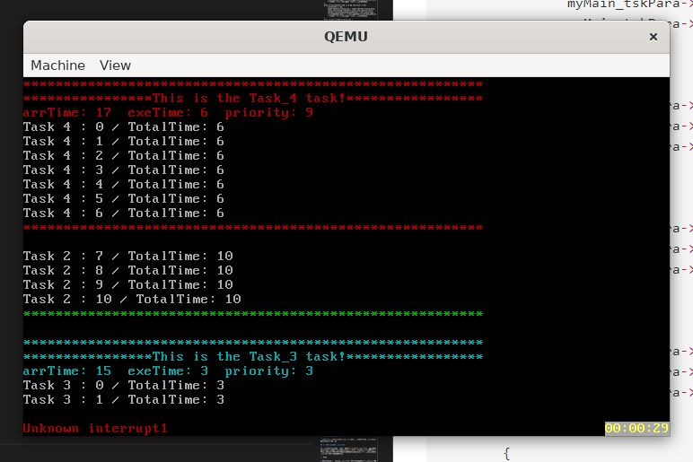

# **Lab5-6实验报告**

## 1.系统结构框图


## 2.主要功能模块及其实现方法

本次实验主要完成了内核模块的任务管理机制

1. task.c

```C
#define ready 0 // ready 状态
#define waiting 1 // waiting 状态
#define killing 2 // killing 状态

typedef struct tskPara {
    unsigned long priority; //优先级
    unsigned long arrTime; //到达时间
    unsigned long exeTime; //执行时间
} tskPara;

typedef struct myTCB{
	unsigned long tid; // 任务ID
	unsigned long status; // 任务状态
    unsigned long* stack_top; // 栈顶指针
    unsigned long* stack_base; // 栈底指针
    struct myTCB* next_myTCB; //TCB_pool中的下一个myTCB
    struct myTCB* next_Queue; //排队队列中的下一个myTCB
    tskPara* tskPara; //任务参数
} myTCB;

typedef struct TCB_pool{
    myTCB* head;
    unsigned long size;
} TCB_pool;

typedef struct rdyQueue{
    myTCB* head;
    myTCB* tail;
    myTCB* idleTsk;
} rdyQueue; //就绪队列

void stack_init(unsigned long **stk, void (*task)(void));
void init_TCB_pool(void);
int createTsk(void (*tskBody)(void),tskPara *tskPara);
void destroyTsk(int tskIndex);
void context_switch(unsigned long **prevTskStkAddr, unsigned long *nextTskStk);
myTCB* get_Tsk(int tid);

void walk_TCB_list(void);
void walk_rdyQ(void);
void walk_tskPara(tskPara* tmp, int color);

void init_rdyQ(void);
int check_rdyQ(void);

myTCB* nextTask(void);

void idleTsk_func(void);


extern unsigned long tid;
extern TCB_pool* TCB_list;
extern rdyQueue* rdyQ; //维护一个就绪队列
extern unsigned long* preTskStackPointer;
extern myTCB* currentTsk; //当前任务
```

    因为该模块的内容较多，我们就不将程序主体部分放到实验报告当中了，我们仅仅展示其中的头文件，即向外面声明可用的函数；
* 该模块是Lab5应当完成的内容，主要负责任务的初始化和创建，以及就绪队列的初始化；
* 我们使用了`TCB_list`来记录TCB池中的首指针，并且在`init_TCB_pool`函数中创建他；
* 在`createTsk`函数中我们创建当前任务，我们将他初始化好堆栈后存放在`TCB_list`中，需要注意的是，要做好相关的内存错误处理机制，即要面临内存不足的特殊情况处理；
* `context_switch`，这是本次实验较为重要的函数，我们在这个模块中保存当前的栈指针到对应的地址，并且将栈指针切换到新的栈地址。并且通过`push`，`pull`操作来保存现场；
* `destroyTsk`该函数传入需要销毁的TCB的tid值，该模块销毁指定的任务，释放内存，一般是在任务结束后的`tskEnd`函数中执行；
* `init_rdyQ`初始化任务就绪队列，并且创建`idleTsk`，值得注意的是，因为`idleTsk`任务的特殊性，我们并不想把他放进`TCB_list`当中，所以我们没有直接调用`createTsk`函数，而是手动为他申请空间和栈地址；
* `idleTsk_func`这是本次实验的`idle`任务，这个任务在任务池中为空的时候被调用，并且不断地调用`schedule`函数；
* `walk_TCB_list`,`walk_rdyQ`，`walk_tskPara`，这三个函数是用来调试的，我们可以通过这三个函数来查看任务池中的内容；
* `get_Tsk` 这个函数是用来根据给定的tid获取指定的任务，并且返回指定的任务的指针；

2. schedule.c

```c
#include "../../include/FCFS.h"
#include "../../include/SJF.h"
#include "../../include/PRIORITY.h"
#include "../../include/schedule.h"

void schedule(void){
    //功能：本函数负责调度任务
    switch (schedule_type){
        case FCFS:
            FCFS_schedule();
            break;
        case SJF:
            SJF_schedule();
            break;
        case PRIORITY:
            PRIORITY_schedule();
            break;
        default:
            myPrintk(0x7,"The schedule type is not exist!\n");
            break;
    }
}

void tskStart(myTCB* tsk){
    //功能：本函数负责将任务插入就绪队列
    switch (schedule_type){
        case FCFS:
            FCFS_tskStart(tsk);
            break;
        case SJF:
            SJF_tskStart(tsk);
            break;
        case PRIORITY:
            PRIORITY_tskStart(tsk);
            break;
        default:
            myPrintk(0x7,"The schedule type is not exist!\n");
            break;
    }
}

void tskEnd(void){
    //功能：本函数负责将任务从就绪队列中删除
    switch (schedule_type){
        case FCFS:
            FCFS_tskEnd();
            break;
        case SJF:
            SJF_tskEnd();
            break;
        case PRIORITY:
            PRIORITY_tskEnd();
            break;
        default:
            myPrintk(0x7,"The schedule type is not exist!\n");
            break;
    }
}

myTCB* nextTask(void){
    //功能：本函数负责获取下一个要运行的任务
    switch (schedule_type){
        case FCFS:
            return FCFS_nextTask();
            break;
        case SJF:
            return SJF_nextTask();
            break;
        case PRIORITY:
            return PRIORITY_nextTask();
            break;
        default:
            myPrintk(0x7,"The schedule type is not exist!\n");
            break;
    }
}
```

* 该模块是向外面提供调度的接口，我们将各种调度算法包装在这各模块中，程序会根据设定的不同参数来选择不同的调度算法；
* 我们采用这种方式，虽然会一定程度上降低系统的性能，但是这样子更简洁，更方便用户更改不同的调度算法；

3. tsk_arr.c

```C
#include "../../include/task.h"
#include "../../include/myPrintk.h"
#include "../../include/tsk_arr.h"
#include "../../include/schedule.h"

int time;
int run = 0;
void oneTickUpdateTsk(void){
    if(time % 1000 == 0) {
        arrangeTsk();
        if(schedule_type == PRIORITY && run) schedule(); //优先级调度
    }
    time = time + 10;
}

void arrangeTsk(){
    myTCB* tsk = TCB_list->head;
    while(tsk){
        if((tsk->status) == waiting && (tsk->tskPara->arrTime == time / 1000)){
            tskStart(tsk);
        }
        tsk = tsk->next_myTCB;
    }
}
```

* 该模块作为一个函数挂在`tick_hook`中，我们充分利用了这个特性，在每个时钟周期中，我们会调用`oneTickUpdateTsk`函数，这个函数会检查所有的任务，如果任务的到达时间与当前时间相等，那么就启动任务；
* 值得注意的是，如果是抢占式调度算法，我们也会在每秒钟的时候调用`schedule`函数，检查是否需要更改当前的任务计划；

4. FCFS.c

```C
#include "../../../include/myPrintk.h"
#include "../../../include/kmalloc.h"
#include "../../../include/FCFS.h"
#define NULL 0 //定义一个空指针

void FCFS_tskStart(myTCB *tsk){
    //将任务插入就绪队列
    if(tsk->status == ready) myPrintk(0x5,"tskStart: task is already start!\n");
    else{
        tsk->status = ready;
        if(check_rdyQ()){
            rdyQ->head = tsk;
        }
        else{
            rdyQ->tail->next_Queue = tsk;
        }   
        rdyQ->tail = tsk; //将task插入尾部
    }
}

void FCFS_tskEnd(void){
    //将任务从就绪队列中删除
    destroyTsk(currentTsk->tid); //从任务池中销毁任务
    FCFS_schedule(); //调度
}

myTCB* FCFS_nextTask(void){
    //从就绪队列中取出一个任务
    if(check_rdyQ()){
        return rdyQ->idleTsk;
    }
    else{
        myTCB* tsk = rdyQ->head;
        rdyQ->head = rdyQ->head->next_Queue; //取出第一个就绪任务
        if(rdyQ->head == (myTCB*)NULL) rdyQ->tail = (myTCB*)NULL;
        return tsk;
    }
}

myTCB* currentTsk; //当前任务
unsigned long* preTskStackPointer; //上一个任务的栈指针
void FCFS_schedule(void){
    //调度 
    myTCB* tsk = nextTask();
    if(tsk->tid == 0 && currentTsk->tid == 0) return; //如果当前任务以及下一个任务都是idle任务，则不做任何操作
    else{
        currentTsk = tsk;
        rdyQ->idleTsk->stack_top = rdyQ->idleTsk->stack_base;
        stack_init(&rdyQ->idleTsk->stack_top,idleTsk_func);
        context_switch(&preTskStackPointer, tsk->stack_top); //上下文切换，将当前任务的栈指针存储在preTskStackPointer中，将下一个任务的栈指针传入，进行上下文切换
    }
}
```

* 该模块是一个简单的FCFS调度算法，它的基本思想是，每个任务都有一个到达时间，当时间到达时，我们就将该任务插入就绪队列中，然后我们在当前任务结束的时候检查就绪队列中是否还有任务，如果有，则将下一个任务设置为当前任务，如果没有，则将当前任务设置为idle任务；
* 需要注意的一点是`idleTsk`这个任务较为特殊，也就是说如果当前任务是`idleTsk`任务，并且下一个任务也是`idleTsk`任务，我们并不希望重新执行一遍`idleTsk`，但是如果是从现有的任务切换到`idleTsk`任务，我们就希望重新执行一遍`idleTsk`。为了实现这样的机制，我们在`FCFS_schedule`即将切换上下文之前，重新为`idleTsk`初始化一个栈，我们希望他在下一次切换回来的时候，重新运行一遍`idleTsk`；而当当前任务是`idleTsk`下一个任务也是`idleTsk`的时候，我们就不做任何事情；

5. SJF.c

```C
#include "../../../include/SJF.h"
#include "../../../include/myPrintk.h"
void SJF_tskStart(myTCB *tsk){
    //将任务插入就绪队列
    if(tsk->status == ready) myPrintk(0x5,"tskStart: task is already start!\n");
    else{
        tsk->status = ready;
        if(check_rdyQ()){
            rdyQ->head = tsk;
        }
        else{
            rdyQ->tail->next_Queue = tsk;
        }   
        rdyQ->tail = tsk; //将task插入尾部
        tsk->next_Queue = 0;
    }
}

myTCB* currentTsk = 0; //当前任务
void SJF_schedule(void){
    //调度 
    myTCB* tsk = SJF_nextTask();
    if(tsk->tid == 0 && currentTsk->tid == 0 && currentTsk != 0) return; //如果当前任务以及下一个任务都是idle任务，则不做任何操作
    else{
        currentTsk = tsk;
        rdyQ->idleTsk->stack_top = rdyQ->idleTsk->stack_base;
        stack_init(&rdyQ->idleTsk->stack_top,idleTsk_func);
        context_switch(&preTskStackPointer, tsk->stack_top); //上下文切换，将当前任务的栈指针存储在preTskStackPointer中，将下一个任务的栈指针传入，进行上下文切换
    }
}

void SJF_tskEnd(void){
    //将任务从就绪队列中删除
    destroyTsk(currentTsk->tid); //从任务池中销毁任务

    myTCB* tsk = rdyQ->head;
    myTCB* preTsk = 0;
    while(tsk != 0){
        if(tsk == currentTsk){
            if(preTsk == 0){
                rdyQ->head = tsk->next_Queue;
            }
            else{
                preTsk->next_Queue = tsk->next_Queue;
            }
            if(rdyQ->head == 0){
                rdyQ->tail = 0;
            }
            SJF_schedule();
        }
        preTsk = tsk;
        tsk = tsk->next_Queue;
    } //从就绪队列中删除任务
}

myTCB* SJF_nextTask(void){
    if(check_rdyQ()) return rdyQ->idleTsk; //如果任务队列为空，则返回idle任务
    else{
        myTCB* tmp;
        myTCB* min;
        tmp = rdyQ->head->next_Queue;
        min = rdyQ->head;

        while(tmp != 0){
            if(tmp->tskPara->exeTime < min->tskPara->exeTime){
                min = tmp;
            }
            tmp = tmp->next_Queue;
        }
        return min;
    }
}
```

* 该模块是SJF调度算法的核心模块，它的作用是：根据就绪队列中的任务，选择一个执行时间最小的任务，并将其设置为当前任务。我们采用非抢占式的实现方法，也就是说，我们必须等到当前任务执行完毕后，才能执行下一个任务。
* 同时本模块的`idleTsk`也有上一个实验所说的特点，我们不在此赘述；

6. PRIORITY.c

```C
#include "../../../include/PRIORITY.h"
#include "../../../include/myPrintk.h"

myTCB* currentTsk;//当前任务
void PRIORITY_schedule(void){
    myTCB* tsk = PRIORITY_nextTask();

    if(tsk->tid == 0 && currentTsk->tid == 0 && currentTsk != 0) return; //如果当前任务以及下一个任务都是idle任务，则不做任何操作
    else if(currentTsk == 0){
        currentTsk = tsk;
        rdyQ->idleTsk->stack_top = rdyQ->idleTsk->stack_base;
        stack_init(&rdyQ->idleTsk->stack_top,idleTsk_func);
        context_switch(&preTskStackPointer, tsk->stack_top); //上下文切换，将当前任务的栈指针存储在preTskStackPointer中，将下一个任务的栈指针传入，进行上下文切换
    }
    else if(currentTsk->tid == 0 && tsk->tid != 0){
        currentTsk = tsk;
        rdyQ->idleTsk->stack_top = rdyQ->idleTsk->stack_base;
        stack_init(&rdyQ->idleTsk->stack_top,idleTsk_func);
        context_switch(&preTskStackPointer, tsk->stack_top); //上下文切换，将当前任务的栈指针存储在preTskStackPointer中，将下一个任务的栈指针传入，进行上下文切换
    }
    else if(tsk->tskPara->priority > currentTsk->tskPara->priority || currentTsk->status == killing){
        myTCB* tmp;
        tmp = currentTsk;
        currentTsk = tsk;
        rdyQ->idleTsk->stack_top = rdyQ->idleTsk->stack_base;
        stack_init(&rdyQ->idleTsk->stack_top,idleTsk_func);
        context_switch(&tmp->stack_top, tsk->stack_top); //上下文切换，将当前任务的栈指针存储在currentTsk->stack_top中，将下一个任务的栈指针传入，进行上下文切换
    }
    else{
        return;
    }
}

void PRIORITY_tskStart(myTCB *tsk){
    //将任务插入就绪队列
    if(tsk->status == ready) myPrintk(0x5,"tskStart: task is already start!\n");
    else{
        tsk->status = ready;
        if(check_rdyQ()){
            rdyQ->head = tsk;
        }
        else{
            rdyQ->tail->next_Queue = tsk;
        }   
        rdyQ->tail = tsk; //将task插入尾部
        tsk->next_Queue = 0;
    }
}
void PRIORITY_tskEnd(void){
    //将任务从就绪队列中删除
    destroyTsk(currentTsk->tid);
    currentTsk->status = killing;

    myTCB* tmp;
    if(rdyQ->head == currentTsk){
        rdyQ->head = currentTsk->next_Queue;
        if(rdyQ->tail == currentTsk){
            rdyQ->tail = 0;
        }
    }
    else{
        tmp = rdyQ->head;
        while(tmp->next_Queue != currentTsk){
            tmp = tmp->next_Queue;
        }
        tmp->next_Queue = currentTsk->next_Queue;
        if(rdyQ->tail == currentTsk){
            rdyQ->tail = tmp; 
        }
    }
    PRIORITY_schedule();
}
myTCB* PRIORITY_nextTask(void){
    //寻找队伍中最高优先级的任务，不允许同等优先级任务的存在
    if(check_rdyQ()) return rdyQ->idleTsk; //如果任务队列为空，则返回idle任务
    else{
        myTCB* tmp;
        myTCB* max;
        tmp = rdyQ->head->next_Queue;
        max = rdyQ->head;

        while(tmp != 0){
            if(tmp->tskPara->priority > max->tskPara->priority){
                max = tmp;
            }
            tmp = tmp->next_Queue;
        }
        return max;
    }
}
```

* 这是一个抢占式优先级调度算法，需要注意的是我们不允许同等优先级任务的存在，同等优先级任务的存在会导致不可预测的结果；
* 我们的任务的优先级越高，则越优先执行；如果低优先级任务正在运行的时候，这时到达了一个高优先级的任务，我们就会通过上下文切换，保存低优先级任务的现场，并且切换到高优先级的任务；
* 这个算法的`idleTsk`也有上述任务的特点；
* 需要注意的是，因为这是个抢占式任务的管理方法，所以我们需要在每秒钟都运行一遍`PRIORITY_schedule`，这样就能保证高优先级的任务被调度；

7. shell.c

```C
int myExit(int argc, unsigned char **argv){
	/*该模块给用户提供了退出系统的指令，为用户调试提供了基础*/
	//myPrintf(0x7,"Goodbye!\n");
	tskEnd();
}
```

* 我们新增了一行命令，用于退出系统；完成测试

## 3.源代码组织说明（目录组织、Makefile 组织）

* 目录组织

```
.
├── Makefile
├── make.sh
├── multibootheader
│   └── multibootHeader.S
├── myOS
│   ├── Makefile
│   ├── dev
│   │   ├── Makefile
│   │   ├── i8253.c
│   │   ├── i8259A.c
│   │   ├── uart.c
│   │   └── vga.c
│   ├── i386
│   │   ├── CTX_SW.S
│   │   ├── Makefile
│   │   ├── io.c
│   │   ├── irq.S
│   │   └── irqs.c
│   ├── include
│   │   ├── CTX_SW.h
│   │   ├── FCFS.h
│   │   ├── PRIORITY.h
│   │   ├── SJF.h
│   │   ├── i8253.h
│   │   ├── i8259.h
│   │   ├── io.h
│   │   ├── irq.h
│   │   ├── kmalloc.h
│   │   ├── malloc.h
│   │   ├── mem.h
│   │   ├── myPrintk.h
│   │   ├── schedule.h
│   │   ├── string.h
│   │   ├── task.h
│   │   ├── tick.h
│   │   ├── tsk_arr.h
│   │   ├── uart.h
│   │   ├── vga.h
│   │   ├── vsprintf.h
│   │   └── wallClock.h
│   ├── kernel
│   │   ├── Makefile
│   │   ├── mem
│   │   │   ├── Makefile
│   │   │   ├── dPartition.c
│   │   │   ├── eFPartition.c
│   │   │   ├── malloc.c
│   │   │   └── pMemInit.c
│   │   ├── task
│   │   │   ├── Makefile
│   │   │   ├── schedule
│   │   │   │   ├── FCFS.c
│   │   │   │   ├── Makefile
│   │   │   │   ├── PRIORITY.c
│   │   │   │   └── SJF.c
│   │   │   ├── schedule.c
│   │   │   ├── task.c
│   │   │   └── tsk_arr.c
│   │   ├── tick.c
│   │   └── wallClock.c
│   ├── lib
│   │   ├── Makefile
│   │   └── string.c
│   ├── myOS.ld
│   ├── osStart.c
│   ├── printk
│   │   ├── Makefile
│   │   ├── myPrintk.c
│   │   ├── types.h
│   │   └── vsprintf.c
│   ├── start32.S
│   └── userInterface.h
├── userApp
│   ├── Makefile
│   ├── main.c
│   ├── memTestCase.c
│   ├── memTestCase.h
│   ├── shell.c
│   └── shell.h
```

* Makefile 组织文件
```
.
├── MULTI_BOOT_HEADER
│   └── multibootHeader.o
├── OS_OBJS
│   ├── DEV_OBJS
│   │   ├── i8253.o
│   │   ├── i8259A.o
│   │   ├── uart.o
│   │   └── vga.o
│   ├── I386_OBJS
│   │   ├── CTX_SW.o
│   │   ├── io.o
│   │   ├── irq.o
│   │   └── irqs.o
│   ├── KERNEL_OBJS
│   │   ├── MEM_OBJS
│   │   │   ├── dPartition.o
│   │   │   ├── eFPartition.o
│   │   │   ├── malloc.o
│   │   │   └── pMemInit.o
│   │   ├── TASK_OBJS
│   │   │   ├── SCHEDULE_OBJS
│   │   │   │   ├── FCFS.o
│   │   │   │   ├── PRIORITY.o
│   │   │   │   └── SJF.o
│   │   │   ├── schedule.o
│   │   │   ├── task.o
│   │   │   └── tsk_arr.o
│   │   ├── tick.o
│   │   └── wallClock.o
│   ├── LIB_OBJS
│   │   └── string.o
│   ├── osStart.o
│   ├── PRINTK_OBJS
│   │   └── myPrintk.o
│   └── start32.o
└── USERAPP_OBJS
    ├── main.o
    ├── memTestCase.o
    └── shell.o
```

## 4.编译和运行方法说明

* 本次实验使用了目录下的`make.sh`文件进行编译并且运行，在Ubuntu系统下编译以及运行的

## 5.测试用例与运行结果说明

我们在osStart定义了一个全局变量，`schedule_type`，用于指定调度算法，在main.c文件中创建了5个task任务以及一个shell任务，可以自行更改他们的相关参数，来测试不同的调度算法。task任务执行的是打印自身`exeTime`时间长度的数字；

1. FCFS

* 这个算法较为简单，我们让任务按照时间依次到来，观察他在任务队列为空以及有任务的表现；
* 在任务队列为空的时候，任务会被挂起，直到有任务到来；

参数设定：
```C
        {
		myMain_tskPara->arrTime = 1;
		myMain_tskPara->exeTime = 100;
		myMain_tskPara->priority = 1;
	}

	{
		Task_1_tskPara->arrTime = 5;
		Task_1_tskPara->exeTime = 7;
		Task_1_tskPara->priority = 2;
	}

	{
		Task_2_tskPara->arrTime = 15;
		Task_2_tskPara->exeTime = 10;
		Task_2_tskPara->priority = 8;
	}

	{
		Task_3_tskPara->arrTime = 20;
		Task_3_tskPara->exeTime = 20;
		Task_3_tskPara->priority = 3;
	}

	{
		Task_4_tskPara->arrTime = 35;
		Task_4_tskPara->exeTime = 5;
		Task_4_tskPara->priority = 9;
	}

	{
		Task_5_tskPara->arrTime = 50;
		Task_5_tskPara->exeTime = 10;
		Task_5_tskPara->priority = 5;
	}
```

运行结果：


* 可以看出程序按照预期设想，先到先运行相关任务，并且在任务队列为空的时候，进入`idleTsk`，等待任务到来

2. SJF

* 这个算法需要注意的是我们实现的是非抢占式的调度算法，也就是说对于先到来的服务我们是先服务的，在就绪队列中寻找执行时间最短的任务作为下一个任务；

实验参数：

```C
	{
		myMain_tskPara->arrTime = 1;
		myMain_tskPara->exeTime = 100;
		myMain_tskPara->priority = 1;
	}

	{
		Task_1_tskPara->arrTime = 5;
		Task_1_tskPara->exeTime = 7;
		Task_1_tskPara->priority = 2;
	}

	{
		Task_2_tskPara->arrTime = 5;
		Task_2_tskPara->exeTime = 10;
		Task_2_tskPara->priority = 8;
	}

	{
		Task_3_tskPara->arrTime = 5;
		Task_3_tskPara->exeTime = 3;
		Task_3_tskPara->priority = 3;
	}

	{
		Task_4_tskPara->arrTime = 5;
		Task_4_tskPara->exeTime = 6;
		Task_4_tskPara->priority = 9;
	}

	{
		Task_5_tskPara->arrTime = 5;
		Task_5_tskPara->exeTime = 1;
		Task_5_tskPara->priority = 5;
	}
```

实验结果：


* 我们可以看到预期时间最短的任务最先执行，最后才执行预期时间最长的任务2

3. PRIORITY

* 我们实现了抢占式优先级调度算法，需要注意的是我们不允许同等优先级任务的存在；

实验参数：

```C
        {
		myMain_tskPara->arrTime = 1;
		myMain_tskPara->exeTime = 100;
		myMain_tskPara->priority = 1;
	}

	{
		Task_1_tskPara->arrTime = 5;
		Task_1_tskPara->exeTime = 40;
		Task_1_tskPara->priority = 2;
	}

	{
		Task_2_tskPara->arrTime = 10;
		Task_2_tskPara->exeTime = 10;
		Task_2_tskPara->priority = 8;
	}

	{
		Task_3_tskPara->arrTime = 15;
		Task_3_tskPara->exeTime = 3;
		Task_3_tskPara->priority = 3;
	}

	{
		Task_4_tskPara->arrTime = 17;
		Task_4_tskPara->exeTime = 6;
		Task_4_tskPara->priority = 9;
	}

	{
		Task_5_tskPara->arrTime = 35;
		Task_5_tskPara->exeTime = 1;
		Task_5_tskPara->priority = 5;
	}
```

实验结果：





* 我们设计了一个低优先级但是执行时间较长的task_1来方便我们测试上下文切换的正确性，我们发现task_1被切换走多次，但是都可以正确的完成整个任务；
* 我们优先保证了高优先级任务的运行，并且我们从myMain任务到task_1人物的切换中可以发现，因为task_1任务到来比较晚，所以中间有一个空闲期，程序正确地进入了`idleTsk`并且等待下一个任务的运行；

## 6.遇到的问题和解决方案说明

NULL